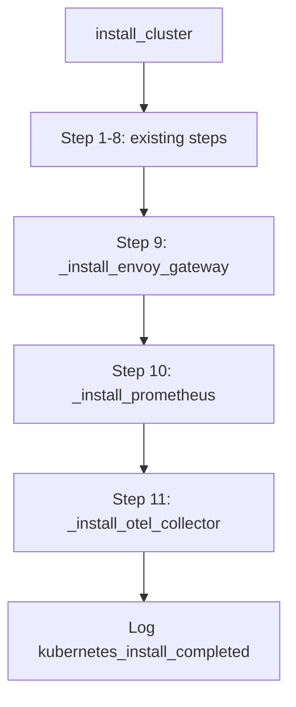

# Design Document: Enhance Kubernetes Initialization

## Overview

This design extends `KubernetesManager.install_cluster` with three new infrastructure installation steps (Steps 9–11) that run after the existing EBS CSI driver setup. The new steps install Envoy Gateway, Prometheus, and the OpenTelemetry Collector operator. Each step follows the existing async subprocess pattern established by `_install_ebs_csi`: shell commands via `asyncio.create_subprocess_exec("bash", "-c", ...)`, non-zero exit code checks raising `KubernetesError`, and structured logging on success.

A new `prometheus_values_url` configuration field is added to `RunnerConfig` so the Prometheus values file URL can be changed via environment variable without code modifications.

## Architecture

The existing architecture remains unchanged. The three new methods are private async methods on `KubernetesManager`, called sequentially from `install_cluster` after Step 8:



Each new method is self-contained and follows the same error-handling contract as `_install_ebs_csi`.

## Components and Interfaces

### RunnerConfig (config.py)

New field added to the existing `RunnerConfig` class:

```python
prometheus_values_url: str = "https://raw.githubusercontent.com/kasbench/globeco-observability/v1.1.5/k8s_aws/values_prometheus.yaml"
```

This field is automatically loadable from the `PROMETHEUS_VALUES_URL` environment variable via pydantic-settings.

### KubernetesManager (kubernetes_manager.py)

**Constructor change**: Add `prometheus_values_url: str` parameter with the default URL value. This keeps the constructor signature simple without requiring a full `RunnerConfig` dependency.

```python
def __init__(
    self,
    ssh_client: SSHClient,
    readiness_timeout_seconds: int = 300,
    poll_interval_seconds: int = 10,
    prometheus_values_url: str = "https://raw.githubusercontent.com/kasbench/globeco-observability/v1.1.5/k8s_aws/values_prometheus.yaml",
) -> None:
```

**New private methods**:

| Method | Step | Description |
|--------|------|-------------|
| `_install_envoy_gateway()` | 9 | Helm install OCI chart + kubectl wait |
| `_install_prometheus()` | 10 | Helm repo add + update + install with values URL |
| `_install_otel_collector()` | 11 | kubectl apply cert-manager, wait, apply otel operator, wait |

### Method Details

#### `_install_envoy_gateway()`

Commands executed:
1. `helm install eg oci://docker.io/envoyproxy/gateway-helm --version v1.8.2 -n envoy-gateway-system --create-namespace`
2. `kubectl wait --timeout=5m -n envoy-gateway-system deployment/envoy-gateway --for=condition=Available`

Each command is run as a separate subprocess call. If either fails (non-zero exit code), raises `KubernetesError` with `step="install_envoy_gateway"`. On success, logs `envoy_gateway_installed`.

#### `_install_prometheus()`

Commands executed:
1. `helm repo add prometheus-community https://prometheus-community.github.io/helm-charts && helm repo update`
2. `helm install prometheus prometheus-community/prometheus -f {self._prometheus_values_url} -n monitoring`

Uses `self._prometheus_values_url` from the constructor parameter. If any command fails, raises `KubernetesError` with `step="install_prometheus"`. On success, logs `prometheus_installed`.

#### `_install_otel_collector()`

Commands executed:
1. `kubectl apply -f https://github.com/cert-manager/cert-manager/releases/latest/download/cert-manager.yaml`
2. `kubectl wait --for=condition=Available deployment --all -n cert-manager --timeout=360s`
3. `kubectl apply -f https://github.com/open-telemetry/opentelemetry-operator/releases/latest/download/opentelemetry-operator.yaml`
4. `kubectl wait --for=condition=Available deployment/opentelemetry-operator-controller-manager -n opentelemetry-operator-system --timeout=360s`

Each command runs sequentially. If any fails, raises `KubernetesError` with `step="install_otel_collector"`. On success, logs `otel_collector_installed`.

## Data Models

No new data models are introduced. The only data change is the new `prometheus_values_url: str` field on the existing `RunnerConfig` pydantic-settings class.

## Error Handling

All three new methods follow the identical error pattern used by `_install_ebs_csi`:

1. Run subprocess via `asyncio.create_subprocess_exec("bash", "-c", command, stdout=PIPE, stderr=PIPE)`
2. Await `proc.communicate()`
3. If `proc.returncode != 0`: raise `KubernetesError(step=..., node=None, command=..., error_output=stderr.decode().strip())`
4. Wrap unexpected exceptions in `KubernetesError` as well

The sequential ordering in `install_cluster` means a failure in Step 9 prevents Steps 10–11 from executing, matching the existing fail-fast behavior.

## Testing Strategy

Property-based testing is **not applicable** for this feature because:
- The code orchestrates external infrastructure (helm, kubectl) via subprocess calls
- Behavior is deterministic per command — it either succeeds or fails
- There are no data transformations or input-space variations to explore
- Running 100 iterations of the same mock wouldn't find more bugs than 2–3

**Testing approach**: Unit tests with mocked `asyncio.create_subprocess_exec`.

### Unit Test Strategy

Each new method gets tests covering:
1. **Happy path**: Mock subprocess returns exit code 0 → verify no exception raised, verify success log emitted
2. **Failure path**: Mock subprocess returns non-zero exit code → verify `KubernetesError` raised with correct step name, command, and error output
3. **Integration in install_cluster**: Verify the three new methods are called in sequence after Step 8

### Test Implementation

- Mock `asyncio.create_subprocess_exec` using `unittest.mock.patch`
- Use `pytest` with `pytest-asyncio` for async test execution
- Verify log output using structlog's testing utilities or caplog
- Tests should be placed alongside existing KubernetesManager tests
