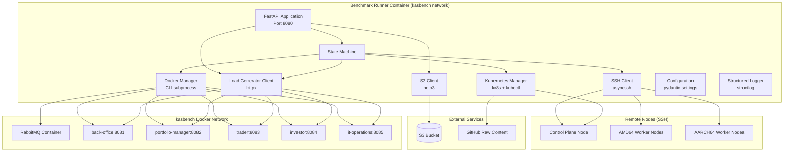
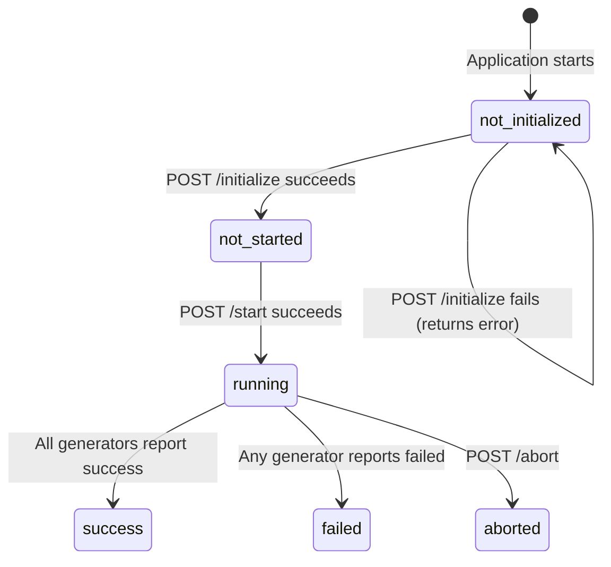

# Design Document: KASBench Benchmark Runner

## Overview

The KASBench Benchmark Runner is a Python FastAPI microservice that orchestrates the full lifecycle of a KASBench benchmark trial. It runs as a Docker container on the Benchmark Runner node within the `kasbench` Docker bridge network. The Runner is responsible for:

1. Configuring a Kubernetes cluster on remote nodes via SSH
2. Deploying the GlobeCo application suite via GitHub-hosted manifests
3. Launching and managing five Load Generator containers
4. Starting, monitoring, and collecting results from benchmark runs
5. Forwarding logs and databases from Load Generators to the Controller

The Runner exposes a REST API consumed by the Benchmark Controller on the Bastion Host. It follows a strict linear lifecycle: initialize → start → monitor → collect results.

### Key Design Decisions

- **Single-process, in-memory state**: The Runner handles one trial at a time and stores all state in memory. There is no database or persistent state beyond S3 artifacts.
- **Async-first**: All I/O (SSH, HTTP, Docker CLI) uses asyncio for concurrency. SSH via asyncssh, HTTP via httpx, and subprocess calls via asyncio.create_subprocess_exec.
- **Fail-fast with verbose errors**: Any failure during initialization aborts immediately with maximum diagnostic detail. No error obfuscation.
- **Streaming proxies**: Output and database downloads use httpx streaming to avoid buffering large files in memory.

## Architecture



### Lifecycle State Machine



## Components and Interfaces

### Package Structure

```
src/kasbench_runner/
├── __init__.py
├── app.py                    # FastAPI application factory and route registration
├── config.py                 # Pydantic Settings configuration class
├── models/
│   ├── __init__.py
│   ├── requests.py           # Pydantic models for API request bodies
│   ├── responses.py          # Pydantic models for API response bodies
│   └── state.py              # Internal state models (BenchmarkState)
├── routes/
│   ├── __init__.py
│   ├── initialize.py         # POST /initialize endpoint
│   ├── start.py              # POST /start endpoint
│   ├── status.py             # GET /status endpoint
│   ├── output.py             # GET /output/{role} endpoint
│   ├── db.py                 # GET /db/{role} endpoint
│   ├── abort.py              # POST /abort endpoint
│   └── metrics.py            # GET /metrics endpoint
├── services/
│   ├── __init__.py
│   ├── ssh_client.py         # SSH command execution via asyncssh
│   ├── docker_manager.py     # Docker CLI operations (network, run, inspect)
│   ├── kubernetes_manager.py # kubeadm, kubectl, kr8s node readiness
│   ├── manifest_parser.py    # k8s.lst file parsing and execution
│   ├── load_generator_client.py  # httpx client for Load Generator API
│   ├── s3_client.py          # boto3 S3 operations (reservation, upload)
│   └── health_checker.py     # Reusable health check retry logic
├── errors.py                 # Custom exception classes and error response builder
└── logging.py                # structlog configuration
```

### Component Responsibilities

| Component | Responsibility |
|-----------|---------------|
| `app.py` | Creates FastAPI app, registers routes, binds startup/shutdown events, initializes shared state |
| `config.py` | Loads environment variables with defaults and validation via pydantic-settings |
| `models/requests.py` | Pydantic models for `InitializeRequest` with field validation and defaults |
| `models/responses.py` | Pydantic models for all API responses (status, error, health) |
| `models/state.py` | `BenchmarkState` singleton holding lifecycle status, timestamps, and init config |
| `services/ssh_client.py` | Async SSH connection, command execution, SCP file copy |
| `services/docker_manager.py` | Docker network validation, container run/inspect via subprocess |
| `services/kubernetes_manager.py` | kubeadm init/join orchestration, namespace/Helm setup, kr8s polling |
| `services/manifest_parser.py` | Parsing k8s.lst lines into typed operations, executing them in sequence |
| `services/load_generator_client.py` | HTTP client for Load Generator /start, /health, /abort, /download-* |
| `services/s3_client.py` | Trial reservation via conditional put, Parquet upload |
| `services/health_checker.py` | Generic retry-with-backoff health check function |
| `errors.py` | Structured error response builder with full diagnostic context |
| `logging.py` | structlog JSON configuration with bound context fields |

### Key Interfaces

```python
# services/ssh_client.py
class SSHClient:
    async def connect(self, hostname: str) -> None: ...
    async def execute(self, command: str) -> SSHResult: ...
    async def copy_from_remote(self, remote_path: str, local_path: str) -> None: ...
    async def close(self) -> None: ...

# services/health_checker.py
async def check_health(
    url: str,
    max_attempts: int,
    interval_seconds: float,
    timeout_seconds: float,
    expected_status: int,
    expected_fields: dict[str, str],
) -> HealthCheckResult: ...

# services/manifest_parser.py
@dataclass
class ManifestOperation:
    op_type: Literal["noop", "comment", "command", "sleep", "manifest"]
    raw_line: str
    value: str | int | None  # command string, sleep seconds, or manifest filename

def parse_manifest_list(content: str) -> list[ManifestOperation]: ...
def serialize_operations(operations: list[ManifestOperation]) -> str: ...

# services/load_generator_client.py
class LoadGeneratorClient:
    async def start(self, role: str, payload: StartPayload) -> None: ...
    async def health(self, role: str) -> HealthResponse: ...
    async def abort(self, role: str) -> AbortResponse: ...
    async def stream_output(self, role: str) -> AsyncIterator[bytes]: ...
    async def stream_db(self, role: str) -> AsyncIterator[bytes]: ...
```

## Data Models

### Request Models

```python
from pydantic import BaseModel, Field, field_validator
from typing import Optional

class InitializeRequest(BaseModel):
    """POST /initialize request body."""
    autoscaler: str = Field(..., min_length=1)
    control_plane_node: str = Field(..., alias="controlPlaneNode", min_length=1)
    amd_worker_nodes: list[str] = Field(..., alias="amdWorkerNodes", min_length=1)
    arm_worker_nodes: list[str] = Field(..., alias="armWorkerNodes", min_length=1)
    s3_bucket: str = Field(..., alias="s3Bucket", min_length=1)
    globeco_url: str = Field(..., alias="globecoUrl", min_length=1)
    
    # Optional with defaults
    run_identifier: str = Field(default="run001", alias="runIdentifier")
    trial_identifier: str = Field(default="trial001", alias="trialIdentifier")
    cluster_cidr_range: str = Field(default="10.244.0.0/16", alias="clusterCidrRange")
    kubernetes_version: str = Field(default="1.36.1", alias="kubernetesVersion")
    load_generator_image: str = Field(
        default="kasbench/kasbench-load-generator:latest",
        alias="loadGeneratorImage"
    )
    run_duration_minutes: int = Field(default=5, alias="runDurationMinutes", ge=1)
    globeco_port: int = Field(default=8080, alias="globecoPort", ge=1, le=65535)
    skip_kubernetes_install: bool = Field(default=False, alias="skipKubernetesInstall")
    skip_manifest_install: bool = Field(default=False, alias="skipManifestInstall")
    force_manifest_install: bool = Field(default=False, alias="forceManifestInstall")

    model_config = {"populate_by_name": True}
```

### Response Models

```python
from pydantic import BaseModel
from datetime import datetime
from typing import Optional

class ErrorResponse(BaseModel):
    """Standard error response with full diagnostic context."""
    error: str
    message: str
    context: dict
    timestamp: datetime

class LoadGeneratorStatus(BaseModel):
    """Individual load generator status within GET /status response."""
    role: str
    status: str
    start_time: Optional[datetime] = Field(alias="startTime")
    end_time: Optional[datetime] = Field(alias="endTime")

class StatusResponse(BaseModel):
    """GET /status response."""
    status: str
    start_time: Optional[datetime] = Field(alias="startTime")
    end_time: Optional[datetime] = Field(alias="endTime")
    load_generators: list[LoadGeneratorStatus] = Field(alias="loadGenerators")

class StartResponse(BaseModel):
    """POST /start response."""
    start_time: datetime = Field(alias="startTime")

class AbortResponse(BaseModel):
    """POST /abort response."""
    abort_time: datetime = Field(alias="abortTime")
    results: dict[str, str]  # role -> "success" | error message
```

### Internal State Model

```python
from enum import Enum
from dataclasses import dataclass, field
from datetime import datetime
from typing import Optional

class BenchmarkStatus(str, Enum):
    NOT_INITIALIZED = "not-initialized"
    NOT_STARTED = "not-started"
    RUNNING = "running"
    SUCCESS = "success"
    FAILED = "failed"
    ABORTED = "aborted"

@dataclass
class BenchmarkState:
    """Mutable singleton holding the entire benchmark lifecycle state."""
    status: BenchmarkStatus = BenchmarkStatus.NOT_INITIALIZED
    config: Optional[InitializeRequest] = None
    start_time: Optional[datetime] = None
    end_time: Optional[datetime] = None
    
    # Internal flags
    kubernetes_installed: bool = False
    globeco_installed: bool = False
    load_generators_installed: bool = False
    
    @property
    def initialization_complete(self) -> bool:
        return (
            self.kubernetes_installed
            and self.globeco_installed
            and self.load_generators_installed
        )
```

### Manifest Parser Models

```python
from dataclasses import dataclass
from typing import Literal

@dataclass
class ManifestOperation:
    """A single parsed operation from a k8s.lst file."""
    op_type: Literal["noop", "comment", "command", "sleep", "manifest"]
    raw_line: str
    value: str | int | None = None
    # For manifest type: value is the final filename (with .yaml appended if needed)
    # For command type: value is the command string to execute
    # For sleep type: value is the integer number of seconds
    # For comment/noop: value is None
```

### Configuration Model

```python
from pydantic_settings import BaseSettings
from pydantic import Field

class RunnerConfig(BaseSettings):
    """Application configuration loaded from environment variables."""
    
    # Server
    host: str = "0.0.0.0"
    port: int = 8080
    
    # SSH
    ssh_user: str = "ubuntu"
    ssh_connect_timeout: int = 30
    
    # Kubernetes
    node_readiness_timeout_seconds: int = Field(
        default=300, ge=60, le=1800,
        alias="NODE_READINESS_TIMEOUT_SECONDS"
    )
    node_readiness_poll_interval: int = 10
    
    # Health checks
    health_check_max_attempts: int = Field(
        default=3, ge=1, le=10,
        alias="HEALTH_CHECK_MAX_ATTEMPTS"
    )
    health_check_interval_seconds: int = Field(
        default=5, ge=1, le=60,
        alias="HEALTH_CHECK_INTERVAL_SECONDS"
    )
    
    # Docker
    rabbitmq_image: str = Field(
        default="rabbitmq:4-management",
        alias="RABBITMQ_IMAGE"
    )
    
    # HTTP client
    http_connect_timeout: int = 10
    http_read_timeout: int = 30
    
    # Manifest fetching
    manifest_fetch_timeout: int = 30

    model_config = {"env_prefix": "", "case_sensitive": False}
```

### Load Generator Role Configuration

```python
from dataclasses import dataclass

VALID_ROLES = ("back-office", "portfolio-manager", "trader", "investor", "it-operations")

ROLE_PORTS: dict[str, int] = {
    "back-office": 8081,
    "portfolio-manager": 8082,
    "trader": 8083,
    "investor": 8084,
    "it-operations": 8085,
}

@dataclass(frozen=True)
class RoleParameters:
    base_load_intensity: int
    base_delay_percentage: int
    spawn_rate: int

ROLE_PARAMS: dict[str, RoleParameters] = {
    "back-office": RoleParameters(100, 100, 10),
    "portfolio-manager": RoleParameters(100, 100, 10),
    "trader": RoleParameters(100, 100, 10),
    "investor": RoleParameters(10, 100, 10),
    "it-operations": RoleParameters(100, 100, 1),
}

MANIFEST_REPOS: list[dict[str, str]] = [
    {"owner": "kasbench", "repo": "globeco-kafka", "tag": "v1.1.1"},
    {"owner": "kasbench", "repo": "globeco-confirmation-service", "tag": "v1.1.1"},
    {"owner": "kasbench", "repo": "globeco-execution-service", "tag": "v1.1.1"},
    {"owner": "kasbench", "repo": "globeco-fix-engine", "tag": "v1.1.1"},
    {"owner": "kasbench", "repo": "globeco-order-generation-service", "tag": "v1.1.1"},
    {"owner": "kasbench", "repo": "globeco-order-service", "tag": "v1.1.1"},
    {"owner": "kasbench", "repo": "globeco-portfolio-accounting-service", "tag": "v1.1.1"},
    {"owner": "kasbench", "repo": "globeco-portfolio-management-portal", "tag": "v1.1.1"},
    {"owner": "kasbench", "repo": "globeco-portfolio-service", "tag": "v1.1.1"},
    {"owner": "kasbench", "repo": "globeco-pricing-service", "tag": "v1.1.1"},
    {"owner": "kasbench", "repo": "globeco-security-service", "tag": "v1.1.1"},
    {"owner": "kasbench", "repo": "globeco-trade-service", "tag": "v1.1.1"},
    {"owner": "kasbench", "repo": "globeco-observability", "tag": "v1.1.1"},
]
```


## Correctness Properties

*A property is a characteristic or behavior that should hold true across all valid executions of a system — essentially, a formal statement about what the system should do. Properties serve as the bridge between human-readable specifications and machine-verifiable correctness guarantees.*

### Property 1: Manifest list round-trip parsing

*For any* valid k8s.lst file content (containing any mix of blank lines, comment lines, command lines, sleep lines, and manifest filename lines), parsing the content into a list of typed operations and then serializing those operations back to text format, then re-parsing that text, SHALL produce an identical ordered list of operations.

**Validates: Requirements 19.9**

### Property 2: Manifest line classification

*For any* single line of text, the manifest parser SHALL classify it into exactly one operation type according to these rules: whitespace-only → noop, first non-whitespace is `#` → comment, first non-whitespace is `>` with content → command, first non-whitespace is `+` with valid integer > 0 → sleep, otherwise non-blank → manifest. Furthermore, for manifest lines, if the trimmed filename does not end in `.yaml`, the resulting operation's value SHALL have `.yaml` appended.

**Validates: Requirements 19.1, 19.2, 19.3, 19.4, 19.5, 19.7**

### Property 3: Success endTime is the maximum across generators

*For any* set of five load generator health responses where all report status `success`, the Runner's recorded `end_time` SHALL equal the maximum (latest) `endTime` value across all five responses.

**Validates: Requirements 1.4, 8.3**

### Property 4: Failure endTime is the minimum among failed generators

*For any* set of load generator health responses where at least one reports status `failed`, the Runner's recorded `end_time` SHALL equal the minimum (earliest) `endTime` value among the generators reporting `failed` status.

**Validates: Requirements 1.5, 8.4**

### Property 5: Non-terminal status mix preserves current status

*For any* set of load generator health responses containing no `failed` status and not all `success` (i.e., at least one is `running` or `not-started`), the Runner's `Benchmark_Status` SHALL remain unchanged from its value before the status check.

**Validates: Requirements 8.5**

### Property 6: Required field validation rejects invalid requests

*For any* POST /initialize request body where one or more required fields (`autoscaler`, `controlPlaneNode`, `amdWorkerNodes`, `armWorkerNodes`, `s3Bucket`, `globecoUrl`) are missing, empty strings, blank strings, or empty arrays, the Runner SHALL return HTTP 422 and the response SHALL identify every invalid field.

**Validates: Requirements 2.1, 2.2**

### Property 7: Optional field defaults are applied correctly

*For any* valid POST /initialize request where any subset of optional fields is omitted, the resulting persisted configuration SHALL contain the documented default value for each omitted field (`runIdentifier`="run001", `trialIdentifier`="trial001", `clusterCidrRange`="10.244.0.0/16", `kubernetesVersion`="1.36.1", `loadGeneratorImage`="kasbench/kasbench-load-generator:latest", `runDurationMinutes`=5, `globecoPort`=8080, `skipKubernetesInstall`=false, `skipManifestInstall`=false, `forceManifestInstall`=false).

**Validates: Requirements 2.3, 2.4**

### Property 8: Type mismatch returns 422 with diagnostic info

*For any* POST /initialize request where a field value has an incorrect type (e.g., string where integer is expected, integer where array is expected), the Runner SHALL return HTTP 422 and the response SHALL identify the field name, the expected type, and the received type.

**Validates: Requirements 2.5**

### Property 9: Invalid role rejection

*For any* string that is not one of the five valid roles (`back-office`, `portfolio-manager`, `trader`, `investor`, `it-operations`), GET /output/{role} and GET /db/{role} SHALL return HTTP 400 with the invalid value and the list of valid roles.

**Validates: Requirements 9.5, 10.5**

### Property 10: Error response structure completeness

*For any* error condition encountered during Runner operation, the HTTP error response SHALL be a JSON object containing all four required fields: `error` (string), `message` (string), `context` (object), and `timestamp` (ISO 8601 UTC string).

**Validates: Requirements 11.1, 11.2**

### Property 11: Operation-specific error context fields

*For any* SSH command failure, the error context SHALL include `hostname`, `command`, `exit_code`, and `stderr`. *For any* Docker operation failure, the error context SHALL include `container_name`, `image`, `operation`, and `error_output`. *For any* HTTP request failure to a Load Generator, the error context SHALL include `url`, `method`, `status_code` (or connection error), and `response_body`.

**Validates: Requirements 11.4, 11.5, 11.6**

### Property 12: Health check exhaustion reports

*For any* health check invocation with `max_attempts` N where all N attempts fail (non-matching response or connection error), the returned failure result SHALL contain the last HTTP status code (or connection error description), the last response body (if any), and the total attempt count equal to N.

**Validates: Requirements 14.3**

### Property 13: Configuration environment variable validation

*For any* numeric environment variable (`NODE_READINESS_TIMEOUT_SECONDS`, `HEALTH_CHECK_MAX_ATTEMPTS`, `HEALTH_CHECK_INTERVAL_SECONDS`) with a value that is either non-integer or outside its valid range, the Runner SHALL log a WARNING and apply the documented default value. *For any* value within the valid range, the Runner SHALL use that value.

**Validates: Requirements 18.2, 18.3, 18.4, 18.6**

## Error Handling

### Error Response Builder

All errors flow through a centralized `build_error_response` function that ensures every error response conforms to the required structure:

```python
from datetime import datetime, timezone

def build_error_response(
    error: str,
    message: str,
    status_code: int,
    **context_fields,
) -> JSONResponse:
    """Build a structured error response with full diagnostic context."""
    return JSONResponse(
        status_code=status_code,
        content={
            "error": error,
            "message": message,
            "context": context_fields,
            "timestamp": datetime.now(timezone.utc).isoformat(),
        },
    )
```

### Exception Hierarchy

```python
class RunnerError(Exception):
    """Base exception for all Runner operations."""
    def __init__(self, error: str, message: str, **context):
        self.error = error
        self.message = message
        self.context = context

class SSHError(RunnerError):
    """SSH command execution failure."""
    def __init__(self, hostname: str, command: str, exit_code: int, stderr: str):
        super().__init__(
            error="ssh_command_failed",
            message=f"Command failed on {hostname} with exit code {exit_code}",
            hostname=hostname, command=command, exit_code=exit_code, stderr=stderr,
        )

class DockerError(RunnerError):
    """Docker operation failure."""
    def __init__(self, container_name: str, image: str, operation: str, error_output: str):
        super().__init__(
            error="docker_operation_failed",
            message=f"Docker {operation} failed for container {container_name}",
            container_name=container_name, image=image,
            operation=operation, error_output=error_output,
        )

class LoadGeneratorError(RunnerError):
    """HTTP communication failure with a Load Generator."""
    def __init__(self, url: str, method: str, status_code: int | None, response_body: str):
        super().__init__(
            error="load_generator_request_failed",
            message=f"{method} {url} failed",
            url=url, method=method, status_code=status_code,
            response_body=response_body[:10000],
        )

class ManifestError(RunnerError):
    """Manifest installation failure."""
    def __init__(self, repo: str, command: str, stderr: str):
        super().__init__(
            error="manifest_install_failed",
            message=f"Manifest operation failed in repository {repo}",
            repository=repo, command=command, stderr=stderr,
        )
```

### Global Exception Handler

A FastAPI exception handler catches `RunnerError` subclasses and converts them to structured JSON responses:

```python
@app.exception_handler(RunnerError)
async def runner_error_handler(request: Request, exc: RunnerError) -> JSONResponse:
    return build_error_response(
        error=exc.error,
        message=exc.message,
        status_code=500,
        **exc.context,
    )
```

### Error Categories by HTTP Status

| Status | When |
|--------|------|
| 400 | Invalid role parameter |
| 409 | Duplicate trial reservation, already initialized, already running, not running (for abort) |
| 422 | Request validation failure (missing/empty fields, type mismatch) |
| 500 | SSH failure, Docker failure, S3 error, Load Generator error, Kubernetes setup failure |
| 502 | Cannot connect to Load Generator (proxy errors for /output, /db) |

## Testing Strategy

### Property-Based Testing

The project uses **Hypothesis** (Python's PBT library) for property-based tests. Each property test runs a minimum of 100 iterations.

**Library**: `hypothesis`
**Configuration**: Each test uses `@settings(max_examples=100)` minimum.

Properties to implement as PBT:
1. **Manifest round-trip** — Generate random k8s.lst content, verify parse→serialize→parse stability
2. **Line classification** — Generate random lines, verify correct classification per rules
3. **EndTime aggregation (success)** — Generate random timestamps, verify max selection
4. **EndTime aggregation (failure)** — Generate random timestamps with mixed statuses, verify min-of-failed selection
5. **Non-terminal status preservation** — Generate non-terminal status mixes, verify no state change
6. **Required field validation** — Generate requests with random missing/empty fields, verify rejection
7. **Optional field defaults** — Generate requests with random subsets of optional fields omitted
8. **Type mismatch validation** — Generate type-incorrect values, verify 422 with diagnostics
9. **Invalid role rejection** — Generate random non-role strings, verify 400
10. **Error response structure** — Generate random errors, verify JSON structure
11. **Error context completeness** — Generate failures per subsystem, verify context fields
12. **Health check exhaustion** — Generate random attempts/responses, verify failure result
13. **Config validation with fallback** — Generate random env values, verify range/default behavior

**Tag format**: Each property test is tagged with a comment:
```python
# Feature: kasbench-runner, Property 1: Manifest list round-trip parsing
```

### Unit Tests (Example-Based)

Unit tests cover specific examples and edge cases not suited for PBT:
- State transitions (initialize → not-started, start → running, etc.)
- Guard conditions (409 responses for wrong state)
- Specific error messages (Docker network not found, S3 precondition failed)
- Response format verification

### Integration Tests

Integration tests use mocked external services to verify orchestration:
- Full initialization flow with mocked SSH, Docker, and S3
- Start flow with mocked Load Generator responses
- Status polling with mocked health responses
- Stream forwarding for /output and /db endpoints

### Test Dependencies

```toml
[tool.uv.dev-dependencies]
pytest = ">=8.0"
pytest-asyncio = ">=0.23"
hypothesis = ">=6.100"
httpx = ">=0.27"  # for TestClient
respx = ">=0.21"  # for mocking httpx
pytest-structlog = ">=1.0"  # for log assertions
```
