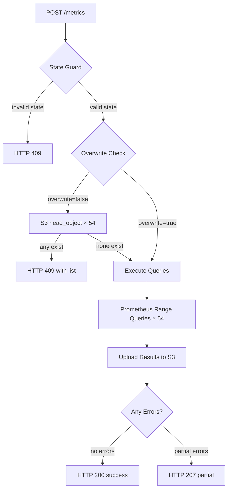
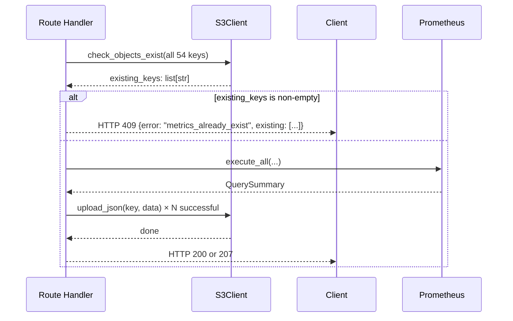

# Design Document: Metrics to S3

## Overview

This feature replaces the existing placeholder GET /metrics endpoint with a POST /metrics endpoint that orchestrates end-to-end Prometheus metric collection and S3 storage. The endpoint executes 54 predefined PromQL range queries (36 counter-type with rate/interval substitution, 18 gauge-type instant queries) against the cluster's Prometheus instance, and uploads each JSON result as a separate file to S3 under the trial's prefix.

Key behaviors:
- State guard: rejects requests unless benchmark status is "success", "failed", or "aborted"
- Overwrite protection: when disabled (default), checks all 54 S3 keys before writing any, returning HTTP 409 if any exist
- Error accumulation: queries and uploads that fail are recorded and returned as a summary rather than halting the pipeline
- Configurable parameters: interval (default "60s"), step (default "15s"), overwrite (default false)

## Architecture



### Module Layout

```
src/kasbench_runner/
├── services/
│   ├── metrics_config.py       # NEW: static metric definitions (counter + gauge dicts)
│   ├── prometheus_client.py    # NEW: range query execution with httpx
│   └── s3_client.py            # EXTENDED: add upload_json, check_objects_exist methods
├── routes/
│   └── metrics.py              # REPLACED: POST handler with new logic
├── models/
│   ├── requests.py             # EXTENDED: MetricsRequest model
│   └── responses.py            # EXTENDED: MetricsResponse, MetricsErrorEntry
└── errors.py                   # no changes needed (uses build_error_response)
```

## Components and Interfaces

### 1. Metrics Configuration Module (`services/metrics_config.py`)

A pure-data module containing the 36 counter and 18 gauge metric definitions. No logic beyond data structure definition.

```python
from dataclasses import dataclass


@dataclass(frozen=True)
class MetricDefinition:
    """A single metric query definition."""
    metric: str          # e.g. "container_cpu_usage_seconds_total"
    description: str     # human-readable description
    query: str           # PromQL template (may contain __INTERVAL__)
    name: str            # S3 output filename (without extension)
    metric_type: str     # "counter" or "gauge"


COUNTER_METRICS: list[MetricDefinition] = [...]  # 36 entries from requirement_002.md
GAUGE_METRICS: list[MetricDefinition] = [...]    # 18 entries from requirement_002.md

ALL_METRICS: list[MetricDefinition] = COUNTER_METRICS + GAUGE_METRICS
```

**Design Rationale**: Separating metric definitions into a data-only module means adding/removing metrics requires editing only this file. The query engine iterates generically over `ALL_METRICS` without metric-specific branching.

### 2. Prometheus Client (`services/prometheus_client.py`)

Responsible for constructing URLs, performing interval substitution, executing range queries, and accumulating errors.

```python
@dataclass
class QueryResult:
    """Result of a single Prometheus range query."""
    metric_name: str
    success: bool
    response_json: dict | None = None  # Full Prometheus JSON response on success
    error_message: str | None = None   # Error description on failure


@dataclass
class QuerySummary:
    """Aggregate result after all queries complete."""
    results: list[QueryResult]

    @property
    def successful(self) -> list[QueryResult]:
        return [r for r in self.results if r.success]

    @property
    def failed(self) -> list[QueryResult]:
        return [r for r in self.results if not r.success]

    @property
    def all_succeeded(self) -> bool:
        return len(self.failed) == 0


class PrometheusClient:
    def __init__(self, control_plane_node: str, connect_timeout: float = 10.0, read_timeout: float = 30.0):
        ...

    def build_url(self) -> str:
        """Returns http://{control_plane_node}:80/api/v1/query_range"""
        ...

    def substitute_interval(self, query: str, interval: str) -> str:
        """Replace __INTERVAL__ with interval value. Returns query unchanged if no placeholder."""
        ...

    async def execute_all(
        self,
        metrics: list[MetricDefinition],
        start_ts: float,
        end_ts: float,
        step: str,
        interval: str,
    ) -> QuerySummary:
        """Execute all metric queries sequentially, accumulating results."""
        ...
```

**Key Decisions**:
- Sequential execution (not concurrent): Prometheus on a single control plane node could be overwhelmed by 54 concurrent range queries. Sequential is safer and simpler.
- Uses `httpx.AsyncClient` consistent with existing codebase patterns.
- Per-query timeout of 30 seconds; connection failures are caught and recorded without halting.

### 3. S3 Client Extensions (`services/s3_client.py`)

Two new methods added to the existing `S3Client` class:

```python
async def check_objects_exist(self, keys: list[str]) -> list[str]:
    """Return list of keys that already exist in the bucket.
    
    Uses head_object for each key. Returns only those that exist.
    Raises S3OperationError if a head_object call fails for reasons other than 404.
    """
    ...

async def upload_json(self, key: str, data: bytes) -> None:
    """Upload JSON bytes to S3 with ContentType application/json.
    
    Raises S3OperationError on failure.
    """
    ...
```

**Design Rationale**: Extending the existing `S3Client` keeps S3 operations consolidated. The `check_objects_exist` method uses `head_object` (lightweight, no data transfer) rather than `list_objects_v2` because the keys are known exactly and the number (54) is small enough for individual checks.

### 4. Route Handler (`routes/metrics.py`)

The POST /metrics handler orchestrates the full pipeline:

```python
@router.post("/metrics")
async def post_metrics(request: Request, body: MetricsRequest = MetricsRequest()) -> JSONResponse:
    """Collect Prometheus metrics and upload to S3."""
    state: BenchmarkState = request.app.state.benchmark_state

    # 1. State guard
    # 2. Validate time bounds (start_time and end_time not None)
    # 3. Overwrite protection (if overwrite=false, check all 54 keys)
    # 4. Execute Prometheus queries
    # 5. Upload successful results to S3
    # 6. Return 200 (all ok) or 207 (partial failures)
```

### 5. Request/Response Models

```python
# models/requests.py
class MetricsRequest(BaseModel):
    """POST /metrics optional request body."""
    overwrite: bool = False
    interval: str = "60s"
    step: str = "15s"

    model_config = {"extra": "ignore"}  # Ignore unrecognized fields (Req 1.6)


# models/responses.py
class MetricsErrorEntry(BaseModel):
    """A single error from metrics collection."""
    metric_name: str = Field(alias="metricName")
    phase: str  # "query" or "upload"
    error: str

    model_config = {"populate_by_name": True, "serialize_by_alias": True}


class MetricsResponse(BaseModel):
    """POST /metrics response body."""
    message: str
    metrics_uploaded: int = Field(alias="metricsUploaded")
    metrics_total: int = Field(alias="metricsTotal")
    s3_prefix: str = Field(alias="s3Prefix")
    errors: list[MetricsErrorEntry] = Field(default_factory=list)
    timestamp: datetime

    model_config = {"populate_by_name": True, "serialize_by_alias": True}
```

## Data Models

### MetricDefinition (internal)

| Field | Type | Description |
|-------|------|-------------|
| metric | str | Prometheus metric name |
| description | str | Human-readable description |
| query | str | PromQL template, may contain `__INTERVAL__` |
| name | str | S3 filename (no extension, appended by uploader) |
| metric_type | str | "counter" or "gauge" |

### S3 Key Format

```
{run_identifier}/{trial_identifier}/metrics/{name}
```

Example: `run001/trial001/metrics/container_cpu_usage_seconds_total-container`

The file content is the raw JSON response from Prometheus's `/api/v1/query_range` endpoint.

### Prometheus Range Query Parameters

| Parameter | Source | Example |
|-----------|--------|---------|
| query | MetricDefinition.query after `__INTERVAL__` substitution | `sum by (container) (rate(container_cpu_usage_seconds_total{namespace="globeco"}[60s]))` |
| start | `BenchmarkState.start_time.timestamp()` (Unix seconds) | `1718000000.0` |
| end | `BenchmarkState.end_time.timestamp()` (Unix seconds) | `1718000300.0` |
| step | `MetricsRequest.step` | `"15s"` |

### BenchmarkState Time Extraction

- `start_time`: Set in `routes/start.py` as `datetime.now(timezone.utc)` when POST /start succeeds
- `end_time`: Set in `routes/status.py` as the latest `end_time` across load generator roles when benchmark completion is detected
- Both are `datetime` objects in UTC. Conversion: `start_time.timestamp()` → Unix float (seconds since epoch)

### Overwrite Check Flow



## Correctness Properties

*A property is a characteristic or behavior that should hold true across all valid executions of a system — essentially, a formal statement about what the system should do. Properties serve as the bridge between human-readable specifications and machine-verifiable correctness guarantees.*

### Property 1: Interval substitution round-trip preserves non-placeholder queries

*For any* PromQL query string that does not contain the literal `__INTERVAL__`, applying the `substitute_interval` function with any interval value SHALL return the original query string unchanged.

**Validates: Requirements 5.2**

### Property 2: Interval substitution replaces all occurrences

*For any* PromQL query string containing one or more occurrences of `__INTERVAL__` and any non-empty interval value, applying `substitute_interval` SHALL produce a result that contains zero occurrences of `__INTERVAL__` and contains the interval value in place of each former placeholder.

**Validates: Requirements 5.1**

### Property 3: Empty/blank interval defaults to "60s"

*For any* PromQL query string containing `__INTERVAL__` and any interval value that is empty or consists only of whitespace, applying the interval substitution logic SHALL use "60s" as the substitution value.

**Validates: Requirements 5.3**

### Property 4: S3 key construction format invariant

*For any* valid run identifier, trial identifier, and metric name, the constructed S3 key SHALL match the pattern `{runIdentifier}/{trialIdentifier}/metrics/{name}` with no leading slash, no double slashes, and no trailing slash.

**Validates: Requirements 7.1**

### Property 5: Overwrite-false prevents any writes when existing keys found

*For any* non-empty set of metric keys where at least one key already exists in S3, when overwrite is false, the system SHALL perform zero S3 put_object calls and SHALL return the names of all existing metrics.

**Validates: Requirements 3.1, 3.2**

### Property 6: Error accumulation preserves all failures

*For any* set of N metric queries where K queries fail (0 ≤ K ≤ N), the returned error list SHALL contain exactly K entries, each identifying the failed metric name and the phase of failure.

**Validates: Requirements 6.4, 6.5, 6.6, 8.2, 8.3**

### Property 7: State guard rejects non-terminal statuses

*For any* BenchmarkStatus in {"not-initialized", "not-started", "running"}, calling POST /metrics SHALL return HTTP 409 without executing any Prometheus queries or S3 operations.

**Validates: Requirements 2.1, 2.2, 2.3**

### Property 8: Timestamp conversion preserves time precision

*For any* UTC datetime representing start_time or end_time, converting to a Unix timestamp via `.timestamp()` and back via `datetime.fromtimestamp(..., tz=timezone.utc)` SHALL produce a datetime within 1 microsecond of the original.

**Validates: Requirements 11.3**

## Error Handling

| Scenario | HTTP Status | Error Code | Response Content |
|----------|-------------|------------|------------------|
| Invalid state (not-initialized, not-started, running) | 409 | `benchmark_not_completed` | Message + current status |
| Missing start_time | 500 | `missing_time_bounds` | Message indicating start time unavailable |
| Missing end_time | 500 | `missing_time_bounds` | Message indicating end time unavailable |
| Overwrite conflict | 409 | `metrics_already_exist` | List of existing metric names |
| S3 existence check failure | 500 | `s3_operation_failed` | Which check failed + reason |
| Partial query/upload failures | 207 | (in body) | List of MetricsErrorEntry with metric_name, phase, error |
| All queries succeed, all uploads succeed | 200 | — | Success message, count, S3 prefix |

**Error Accumulation Pattern**: The handler does not abort on individual query or upload failures. Instead, it collects errors in a list and continues processing remaining metrics. After all metrics are attempted, it returns either 200 (zero errors) or 207 (one or more errors) with full diagnostic information.

**Exception Classes**: No new exception classes needed. The route handler uses `build_error_response()` for guard/conflict errors and returns structured JSON directly for the 200/207 cases. S3 errors during the existence check phase bubble up via the existing `S3OperationError`.

## Testing Strategy

### Property-Based Tests (using Hypothesis)

The feature has clear pure-function components suitable for property-based testing:

1. **Interval substitution** (`substitute_interval`): pure string transformation testable with generated queries and intervals
2. **S3 key construction**: pure string assembly testable with generated identifiers and names
3. **State guard logic**: deterministic state-machine check testable with generated status values
4. **Error accumulation**: testable with generated lists of success/failure results

**Configuration**:
- Library: `hypothesis` (already in dev dependencies)
- Minimum 100 iterations per property test
- Tag format: `Feature: metrics-to-s3, Property {N}: {description}`

### Unit Tests (using pytest + respx)

- Route handler with mocked PrometheusClient and S3Client
- Overwrite protection flow: mock `check_objects_exist` returning various combinations
- HTTP error scenarios: Prometheus returning 500, connection timeouts
- Request validation: empty body, partial body, extra fields ignored
- Time bounds missing: start_time=None, end_time=None

### Integration Tests

- Full endpoint test with `respx` mocking Prometheus HTTP responses and `moto` mocking S3
- Verify correct S3 keys are written with correct content
- Verify error accumulation across multiple failing queries

### Test Organization

```
tests/
├── test_metrics_config.py         # Validates config structure (all 54 metrics defined)
├── test_prometheus_client.py      # Property + unit tests for query execution
├── test_s3_upload.py              # Unit tests for upload_json and check_objects_exist
├── test_metrics_route.py          # Integration tests for POST /metrics handler
└── conftest.py                    # Shared fixtures (mock state, mock S3, mock Prometheus)
```
