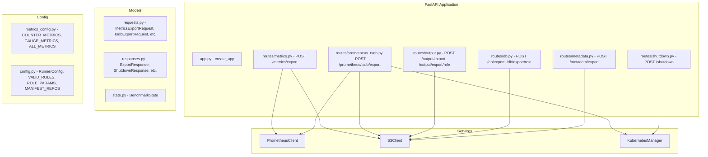

# Design Document: misc-improvements

## Overview

This design covers a set of improvements to the KASBench Runner application:

1. **Endpoint rename**: `/metrics` → `/metrics/export` for naming consistency with other export endpoints
2. **Kafka metrics**: 7 counter + 9 gauge Prometheus metric definitions added to `metrics_config.py`
3. **Configurable Prometheus port**: `prometheusPort` field on `/metrics/export` (and TSDB export) request body, defaulting to 31565
4. **TSDB snapshot export**: `POST /prometheus/tsdb/export` triggers a Prometheus TSDB snapshot, copies it from the prometheus-server pod, and uploads to S3
5. **Output export**: `POST /output/export` and `POST /output/export/{role}` fetch output from load generators and upload to S3
6. **Database export**: `POST /db/export` and `POST /db/export/{role}` fetch databases from load generators and upload to S3
7. **Metadata export**: `POST /metadata/export` constructs a `run_details.json` and uploads to S3
8. **Shutdown**: `POST /shutdown` deletes Kubernetes namespaces sequentially
9. **README update**: Document all new/changed endpoints

All new export endpoints follow the same patterns as the existing codebase: FastAPI routers, Pydantic models, structlog logging, state guards, and the established `build_error_response` pattern.

## Architecture



### Design Decisions

1. **New route modules for new endpoint groups**: `POST /prometheus/tsdb/export` gets its own route file (`routes/prometheus_tsdb.py`), `POST /metadata/export` gets `routes/metadata.py`, and `POST /shutdown` gets `routes/shutdown.py`. Output and DB export endpoints are added to their existing route modules since they share the same domain.

2. **Port parameter passed through, not stored globally**: The `prometheusPort` parameter is passed as an argument to `PrometheusClient.build_url()` rather than changing the class constructor. This keeps the port per-request rather than per-instance, matching the request-scoped nature.

3. **kr8s for pod file copy**: The TSDB snapshot export uses kr8s to exec into the prometheus-server pod and tar/stream the snapshot directory, avoiding kubectl dependency for this operation.

4. **S3Client extended with `upload_bytes`**: A new method `upload_bytes(key, data, content_type)` handles arbitrary byte uploads (for output files, databases, and TSDB snapshots) alongside the existing `upload_json`.

5. **Partial failure pattern reused**: The 207 Multi-Status response pattern from the existing `/metrics` endpoint is reused for `/output/export` and `/db/export` when some roles succeed and others fail.

## Components and Interfaces

### Modified Components

#### `src/kasbench_runner/routes/metrics.py`
- Rename route from `POST /metrics` to `POST /metrics/export`
- Accept `prometheusPort` field in request body (default 31565, validated 1–65535)
- Pass port to `PrometheusClient.build_url()`

#### `src/kasbench_runner/services/prometheus_client.py`
- Modify `build_url()` to accept an optional `port` parameter (default 31565)
- Signature: `def build_url(self, port: int = 31565) -> str`

#### `src/kasbench_runner/services/metrics_config.py`
- Add 7 Kafka counter `MetricDefinition` entries to `COUNTER_METRICS`
- Add 9 Kafka gauge `MetricDefinition` entries to `GAUGE_METRICS`

#### `src/kasbench_runner/models/requests.py`
- Rename `MetricsRequest` to `MetricsExportRequest` and add `prometheus_port: int = Field(default=31565, alias="prometheusPort", ge=1, le=65535)`
- Add `TsdbExportRequest` with optional `prometheus_port`

#### `src/kasbench_runner/services/s3_client.py`
- Add `upload_bytes(key: str, data: bytes, content_type: str) -> None`
- Add `upload_directory(prefix: str, local_dir: str) -> list[str]` for uploading TSDB snapshot directories

#### `src/kasbench_runner/app.py`
- Register new routers: `prometheus_tsdb`, `metadata`, `shutdown`
- Add new export routes to existing `output` and `db` routers

### New Components

#### `src/kasbench_runner/routes/prometheus_tsdb.py`
- `POST /prometheus/tsdb/export`
- Triggers Prometheus TSDB snapshot via admin API
- Copies snapshot from pod using kr8s
- Uploads to S3

#### `src/kasbench_runner/routes/metadata.py`
- `POST /metadata/export`
- Constructs `run_details.json` from BenchmarkState, RunnerConfig, ROLE_PARAMS, MANIFEST_REPOS, and status
- Uploads to S3

#### `src/kasbench_runner/routes/shutdown.py`
- `POST /shutdown`
- Deletes namespaces: globeco, elasticsearch, observability, monitoring
- Sequential with 60s timeout per namespace
- Continues on failure

### Interface Contracts

#### POST /metrics/export
```python
# Request
class MetricsExportRequest(BaseModel):
    overwrite: bool = False
    interval: str = "60s"
    step: str = "15s"
    prometheus_port: int = Field(default=31565, alias="prometheusPort", ge=1, le=65535)

# Response: same as current MetricsResponse (200/207/409/500)
```

#### POST /prometheus/tsdb/export
```python
# Request
class TsdbExportRequest(BaseModel):
    prometheus_port: int = Field(default=31565, alias="prometheusPort", ge=1, le=65535)

# Response 200
{"s3Path": "run001/trial001/tsdb-snapshots", "timestamp": "2024-01-15T10:30:00Z"}

# Error responses: 409 (not initialized), 500 (pod not found, copy failed, S3 failed), 502 (Prometheus API failed)
```

#### POST /output/export and POST /output/export/{role}
```python
# Response 200
{"message": "Export complete", "filesExported": 5, "s3Prefix": "run001/trial001/output/", "timestamp": "..."}

# Response 207 (partial)
{"message": "Export completed with errors", "results": [{"role": "trader", "status": "success", "s3Key": "..."}, {"role": "investor", "status": "failed", "error": "..."}], "timestamp": "..."}

# Error responses: 400 (invalid role), 409 (not initialized), 500 (S3 failed), 502 (LG connection failed)
```

#### POST /db/export and POST /db/export/{role}
```python
# Response 200
{"message": "Export complete", "results": [{"role": "...", "s3Key": "..."}], "timestamp": "..."}

# Error responses: 400 (invalid role), 409 (not initialized), 500 (S3 failed), 502 (LG failed)
```

#### POST /metadata/export
```python
# Response 200
{"s3Key": "run001/trial001/run_details.json", "timestamp": "2024-01-15T10:30:00Z"}

# Error responses: 409 (not initialized), 500 (S3 failed)
```

#### POST /shutdown
```python
# Response 200
{"results": [{"namespace": "globeco", "status": "deleted"}, {"namespace": "elasticsearch", "status": "failed", "error": "..."}], "timestamp": "..."}

# Error responses: 409 (not initialized or running)
```

## Data Models

### Request Models (additions to `models/requests.py`)

```python
class MetricsExportRequest(BaseModel):
    """POST /metrics/export request body."""
    overwrite: bool = False
    interval: str = "60s"
    step: str = "15s"
    prometheus_port: int = Field(default=31565, alias="prometheusPort", ge=1, le=65535)
    model_config = {"extra": "ignore", "populate_by_name": True}

class TsdbExportRequest(BaseModel):
    """POST /prometheus/tsdb/export request body."""
    prometheus_port: int = Field(default=31565, alias="prometheusPort", ge=1, le=65535)
    model_config = {"extra": "ignore", "populate_by_name": True}
```

### Response Models (additions to `models/responses.py`)

```python
class ExportResultEntry(BaseModel):
    """Per-role export result."""
    role: str
    status: str  # "success" or "failed"
    s3_key: Optional[str] = Field(default=None, alias="s3Key")
    error: Optional[str] = None
    model_config = {"populate_by_name": True, "serialize_by_alias": True}

class ExportResponse(BaseModel):
    """Generic export response for output/db/metadata exports."""
    message: str
    files_exported: Optional[int] = Field(default=None, alias="filesExported")
    results: Optional[list[ExportResultEntry]] = None
    s3_prefix: Optional[str] = Field(default=None, alias="s3Prefix")
    s3_key: Optional[str] = Field(default=None, alias="s3Key")
    s3_path: Optional[str] = Field(default=None, alias="s3Path")
    timestamp: datetime
    model_config = {"populate_by_name": True, "serialize_by_alias": True}

class NamespaceResult(BaseModel):
    """Per-namespace shutdown result."""
    namespace: str
    status: str  # "deleted" or "failed"
    error: Optional[str] = None

class ShutdownResponse(BaseModel):
    """POST /shutdown response."""
    results: list[NamespaceResult]
    timestamp: datetime
    model_config = {"populate_by_name": True, "serialize_by_alias": True}
```

### run_details.json Structure

```json
{
  "timestamp": "2024-01-15T10:30:00Z",
  "environment": {
    "HOST": "0.0.0.0",
    "PORT": 8080,
    "SSH_USER": "ubuntu",
    "SSH_CONNECT_TIMEOUT": 30,
    "NODE_READINESS_TIMEOUT_SECONDS": 300,
    "NODE_READINESS_POLL_INTERVAL": 10,
    "HEALTH_CHECK_MAX_ATTEMPTS": 3,
    "HEALTH_CHECK_INTERVAL_SECONDS": 5,
    "RABBITMQ_IMAGE": "rabbitmq:4-management",
    "HTTP_CONNECT_TIMEOUT": 10,
    "HTTP_READ_TIMEOUT": 30,
    "MANIFEST_FETCH_TIMEOUT": 30
  },
  "initialization": {
    "autoscaler": "...",
    "controlPlaneNode": "...",
    "amdWorkerNodes": [...],
    "armWorkerNodes": [...],
    "s3Bucket": "...",
    "globecoUrl": "...",
    "runIdentifier": "...",
    "trialIdentifier": "...",
    "clusterCidrRange": "...",
    "kubernetesVersion": "...",
    "loadGeneratorImage": "...",
    "runDurationMinutes": 5,
    "globecoPort": 8080,
    "skipKubernetesInstall": false,
    "skipManifestInstall": false,
    "forceManifestInstall": false
  },
  "roles": {
    "back-office": {"base_load_intensity": 100, "base_delay_percentage": 100, "spawn_rate": 10},
    "portfolio-manager": {...},
    "trader": {...},
    "investor": {...},
    "it-operations": {...}
  },
  "manifests": [
    {"owner": "kasbench", "repo": "globeco-observability", "tag": "v1.1.5"},
    ...
  ],
  "status": {
    "status": "success",
    "startTime": "...",
    "endTime": "...",
    "loadGenerators": [...]
  }
}
```

### Kafka Counter Metrics (7 new entries)

| Metric | Query | Name |
|--------|-------|------|
| kafka_consumer_messages_processed_total | `sum by (service_name, topic) (rate(kafka_consumer_messages_processed_total{service_namespace="globeco"}[__INTERVAL__]))` | kafka_consumer_messages_processed_total-service_name-topic |
| kafka_consumer_messages_failed_total | `sum by (service_name, topic) (rate(kafka_consumer_messages_failed_total{service_namespace="globeco"}[__INTERVAL__]))` | kafka_consumer_messages_failed_total-service_name-topic |
| kafka_consumer_processing_seconds_total | `sum by (service_name, topic) (rate(kafka_consumer_processing_seconds_total{service_namespace="globeco"}[__INTERVAL__]))` | kafka_consumer_processing_seconds_total-service_name-topic |
| kafka_consumer_idle_seconds_total | `sum by (service_name, topic) (rate(kafka_consumer_idle_seconds_total{service_namespace="globeco"}[__INTERVAL__]))` | kafka_consumer_idle_seconds_total-service_name-topic |
| kafka_consumer_records_polled_total | `sum by (service_name, topic) (rate(kafka_consumer_records_polled_total{service_namespace="globeco"}[__INTERVAL__]))` | kafka_consumer_records_polled_total-service_name-topic |
| kafka_consumer_poll_seconds_total | `sum by (service_name, topic) (rate(kafka_consumer_poll_seconds_total{service_namespace="globeco"}[__INTERVAL__]))` | kafka_consumer_poll_seconds_total-service_name-topic |
| kafka_dlq_messages | `sum by (service_name, topic) (rate(kafka_dlq_messages{service_namespace="globeco"}[__INTERVAL__]))` | kafka_dlq_messages-service_name-topic |

### Kafka Gauge Metrics (9 new entries)

| Metric | Query | Name |
|--------|-------|------|
| kafka_consumer_group_lag_ratio | `kafka_consumer_group_lag_ratio` | kafka_consumer_group_lag_ratio |
| kafka_consumer_group_lag_sum_ratio | `kafka_consumer_group_lag_sum_ratio` | kafka_consumer_group_lag_sum_ratio |
| kafka_consumer_group_members | `sum by (instance,group) (kafka_consumer_group_members)` | kafka_consumer_group_members-instance-group |
| kafka_consumer_group_offset_ratio | `kafka_consumer_group_offset_ratio` | kafka_consumer_group_offset_ratio |
| kafka_consumer_group_offset_sum_ratio | `kafka_consumer_group_offset_sum_ratio` | kafka_consumer_group_offset_sum_ratio |
| kafka_dlq_messages_current | `kafka_dlq_messages_current` | kafka_dlq_messages_current |
| kafka_partition_current_offset_ratio | `kafka_partition_current_offset_ratio` | kafka_partition_current_offset_ratio |
| kafka_partition_oldest_offset_ratio | `kafka_partition_oldest_offset_ratio` | kafka_partition_oldest_offset_ratio |
| kafka_topic_partitions | `kafka_topic_partitions` | kafka_topic_partitions |

## Correctness Properties

*A property is a characteristic or behavior that should hold true across all valid executions of a system — essentially, a formal statement about what the system should do. Properties serve as the bridge between human-readable specifications and machine-verifiable correctness guarantees.*

### Property 1: Port-based URL construction

*For any* valid port integer in [1, 65535] and any non-empty control plane node hostname, `PrometheusClient.build_url(port)` SHALL produce a URL of the form `http://{hostname}:{port}/api/v1/query_range`.

**Validates: Requirements 4.1**

### Property 2: Port validation boundaries

*For any* integer value, if it is in the range [1, 65535] then the `MetricsExportRequest` model SHALL accept it as `prometheusPort`, and if it is outside that range (≤ 0 or > 65535) then the model SHALL reject it with a validation error.

**Validates: Requirements 4.3, 4.4**

### Property 3: Invalid role rejection

*For any* string that is not one of the five valid roles (back-office, portfolio-manager, trader, investor, it-operations), the `/output/export/{role}` and `/db/export/{role}` endpoints SHALL return HTTP 400 with the invalid value and the list of valid roles in the error response.

**Validates: Requirements 6.5, 7.5**

### Property 4: Partial role failure yields correct 207 response

*For any* non-empty subset of the five roles that fail during a bulk export (`/output/export` or `/db/export`), the response SHALL be HTTP 207, listing each failed role with status "failed" and each successful role with status "success", with no roles omitted or duplicated.

**Validates: Requirements 6.9**

### Property 5: Run details document completeness

*For any* valid BenchmarkState (with non-null config, start_time), the constructed `run_details.json` document SHALL contain all required top-level keys (`timestamp`, `environment`, `initialization`, `roles`, `manifests`, `status`), the `environment` object SHALL contain all 12 environment configuration fields, the `initialization` object SHALL contain all 15 initialization fields, the `roles` object SHALL contain entries for all 5 valid roles each with `base_load_intensity`, `base_delay_percentage`, and `spawn_rate`, and the `manifests` array SHALL contain entries each with `owner`, `repo`, and `tag` fields.

**Validates: Requirements 8.1, 8.3, 8.4, 8.5, 8.6, 8.7**

### Property 6: Partial namespace failure yields correct response

*For any* subset of the four namespaces (globeco, elasticsearch, observability, monitoring) that fail or timeout during shutdown, the response SHALL list each namespace with its correct status ("deleted" or "failed") and failed namespaces SHALL include an error detail, with all four namespaces represented exactly once.

**Validates: Requirements 9.3, 9.4**

## Error Handling

All new endpoints follow the established `build_error_response` pattern from `errors.py`:

| Endpoint | Condition | Status | Error Key |
|----------|-----------|--------|-----------|
| POST /metrics/export | State not terminal | 409 | `benchmark_not_completed` |
| POST /metrics/export | Invalid prometheusPort | 422 | Pydantic validation error (automatic) |
| POST /prometheus/tsdb/export | Not initialized | 409 | `benchmark_not_initialized` |
| POST /prometheus/tsdb/export | Prometheus API fails/timeout | 502 | `prometheus_snapshot_failed` |
| POST /prometheus/tsdb/export | Pod not found | 500 | `prometheus_pod_not_found` |
| POST /prometheus/tsdb/export | Pod copy fails | 500 | `snapshot_copy_failed` |
| POST /prometheus/tsdb/export | S3 upload fails | 500 | `s3_operation_failed` |
| POST /output/export | Not initialized | 409 | `benchmark_not_initialized` |
| POST /output/export/{role} | Invalid role | 400 | `invalid_role` |
| POST /output/export | LG connection fails | 502 | `load_generator_connection_failed` |
| POST /output/export | S3 upload fails | 500 | `s3_operation_failed` |
| POST /output/export | Partial failures | 207 | Per-role results in body |
| POST /db/export | Not initialized | 409 | `benchmark_not_initialized` |
| POST /db/export/{role} | Invalid role | 400 | `invalid_role` |
| POST /db/export | LG non-200 or timeout | 502 | `upstream_error` |
| POST /db/export | S3 upload fails | 500 | `s3_operation_failed` |
| POST /metadata/export | Not initialized | 409 | `benchmark_not_initialized` |
| POST /metadata/export | S3 upload fails | 500 | `s3_operation_failed` |
| POST /shutdown | Not initialized | 409 | `benchmark_not_initialized` |
| POST /shutdown | Running | 409 | `benchmark_running` |

### Pydantic Validation

Port validation (1–65535) is handled by Pydantic's `ge=1, le=65535` constraint on the `prometheus_port` field. Invalid values automatically return HTTP 422 with the standard FastAPI validation error response.

### Timeout Strategy

- Prometheus TSDB snapshot API: 30s httpx timeout
- Pod file copy: no explicit timeout (kr8s handles internally)
- Load generator fetch (output/db): 10s connect timeout, no read timeout (streams)
- Namespace deletion: 60s per namespace using `asyncio.wait_for`

## Testing Strategy

### Unit Tests (pytest)

Unit tests cover:
- **Metrics config**: Verify all 7 Kafka counter and 9 Kafka gauge metrics exist with correct fields
- **Request model validation**: MetricsExportRequest and TsdbExportRequest port validation (valid/invalid ports)
- **URL construction**: PrometheusClient.build_url with custom and default ports
- **Role validation**: Invalid role handling in export endpoints
- **Metadata construction**: run_details.json document structure from known state
- **State guards**: Each new endpoint rejects NOT_INITIALIZED (and RUNNING for shutdown)

### Property-Based Tests (Hypothesis)

Property-based tests validate the 6 correctness properties above. Each runs a minimum of 100 iterations.

- **Library**: Hypothesis (already available in Python ecosystem, natural fit for Pydantic model testing)
- **Configuration**: `@settings(max_examples=100)`
- **Tag format**: `# Feature: misc-improvements, Property {N}: {description}`

Properties 1–2 test pure functions (URL construction, Pydantic validation) and are cheap to run.
Properties 3–6 test application logic with mocked external dependencies.

### Integration Tests (pytest with httpx TestClient)

Integration tests with mocked services (httpx mock, boto3 mock, kr8s mock):
- Full request/response cycle for each new endpoint
- Error path coverage (502, 500, 409 scenarios)
- 207 partial failure response with mixed results
- TSDB snapshot workflow (mock Prometheus API, pod exec, S3)

### What Is NOT Property Tested

- Kafka metric config (static data — smoke tests only)
- README content (manual review)
- External service orchestration (integration tests with mocks)
- Endpoint routing (example-based tests)
