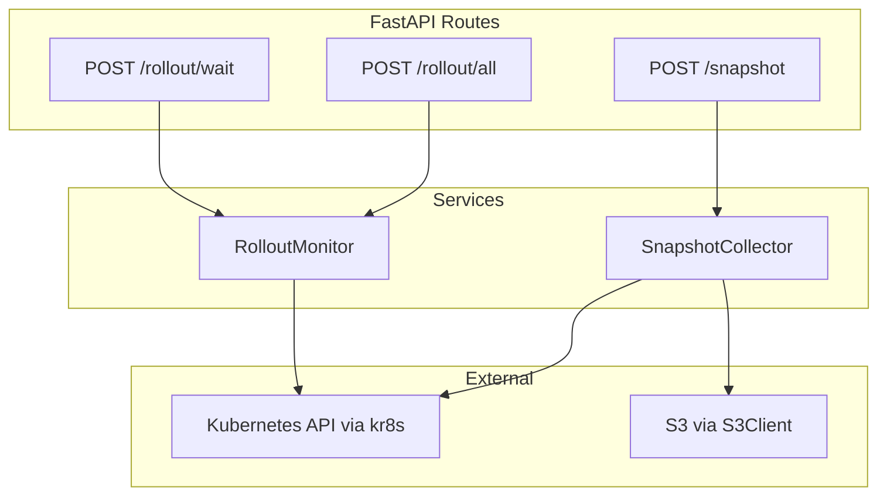
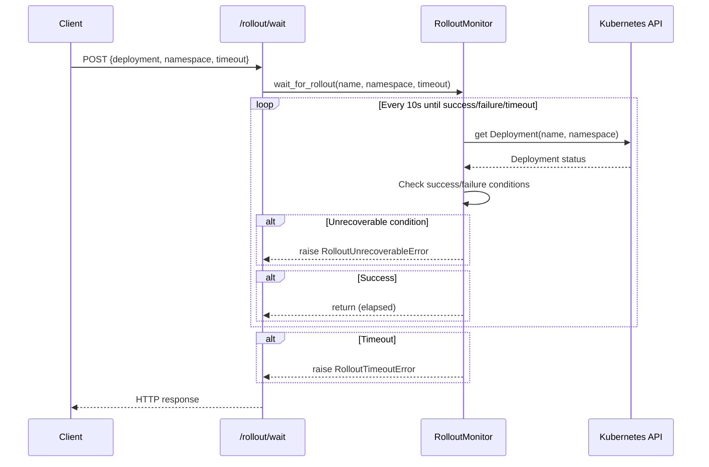
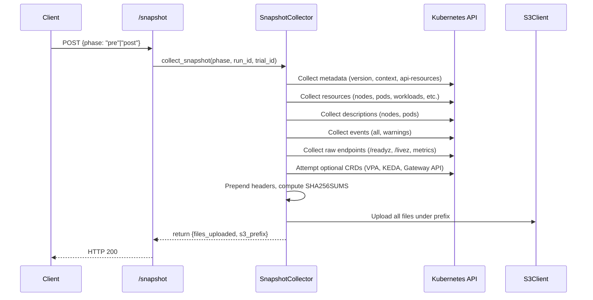

# Design Document: Rollout and Snapshot

## Overview

This feature introduces two core services to the KASBench Benchmark Runner:

1. **RolloutMonitor** — Polls Kubernetes Deployments via kr8s until rollout completes or a terminal failure is detected. Supports single-deployment and batch-deployment modes with configurable timeouts, retry logic for transient API errors, and early termination on unrecoverable conditions.

2. **SnapshotCollector** — Captures a comprehensive cluster state snapshot (resource manifests, metadata, descriptions, events, raw API responses) and uploads all files to S3 with integrity verification via SHA-256 checksums.

Three new REST API endpoints expose these capabilities: `POST /rollout/wait`, `POST /rollout/all`, and `POST /snapshot`.

## Architecture



### Sequence: Single Deployment Rollout



### Sequence: Snapshot Collection



## Components and Interfaces

### Service: RolloutMonitor

**Location:** `src/kasbench_runner/services/rollout_monitor.py`

Responsible for polling Kubernetes Deployments until rollout completes, times out, or encounters an unrecoverable condition.

```python
class RolloutMonitor:
    """Monitors Kubernetes Deployment rollouts via kr8s."""

    POLL_INTERVAL: int = 10  # seconds
    RETRY_LIMIT: int = 3
    RETRY_DELAY: int = 15  # seconds

    UNRECOVERABLE_POD_CONDITIONS: set[str] = {
        "CrashLoopBackOff",
        "ImagePullBackOff",
        "ErrImagePull",
        "InvalidImageName",
        "CreateContainerConfigError",
    }

    async def wait_for_rollout(
        self,
        deployment_name: str,
        namespace: str,
        timeout_seconds: int,
    ) -> float:
        """Wait for a single deployment rollout to complete.

        Args:
            deployment_name: Name of the Deployment resource.
            namespace: Kubernetes namespace.
            timeout_seconds: Maximum wait time in seconds.

        Returns:
            Elapsed time in seconds.

        Raises:
            DeploymentNotFoundError: Deployment does not exist.
            RolloutTimeoutError: Timeout elapsed before completion.
            RolloutUnrecoverableError: Terminal condition detected.
            KubernetesApiError: API unreachable after retries.
        """
        ...

    async def wait_for_all_rollouts(
        self,
        deployments: list[DeploymentSpec],
        timeout_seconds: int,
    ) -> None:
        """Wait for multiple deployments concurrently under a shared timeout.

        Args:
            deployments: List of (name, namespace) tuples.
            timeout_seconds: Maximum wall-clock time for the entire batch.

        Raises:
            RolloutTimeoutError: Timeout with list of incomplete deployments.
            RolloutUnrecoverableError: Any deployment hit terminal condition.
            KubernetesApiError: API unreachable after retries.
        """
        ...

    def _is_rollout_complete(self, deployment_status: dict) -> bool:
        """Check if deployment meets success criteria.

        Success: updatedReplicas == replicas, readyReplicas == replicas,
        and Progressing condition reason == "NewReplicaSetAvailable".
        """
        ...

    def _check_unrecoverable_deployment_condition(
        self, conditions: list[dict]
    ) -> str | None:
        """Return the unrecoverable reason if found, else None."""
        ...

    async def _check_pod_conditions(
        self, deployment_name: str, namespace: str
    ) -> tuple[str, str] | None:
        """Check pods for unrecoverable states.

        Returns (pod_name, condition) if found, else None.
        """
        ...

    async def _fetch_deployment_with_retry(
        self, deployment_name: str, namespace: str
    ) -> object:
        """Fetch deployment from K8s API with transient error retries.

        Retries up to RETRY_LIMIT times with RETRY_DELAY between attempts
        for connection errors and HTTP 5xx responses.
        """
        ...
```

### Service: SnapshotCollector

**Location:** `src/kasbench_runner/services/snapshot_collector.py`

Responsible for collecting cluster state and uploading to S3.

```python
class SnapshotCollector:
    """Collects Kubernetes cluster state and uploads to S3."""

    REQUIRED_METADATA_FILES: list[str] = [
        "metadata/date.txt",
        "metadata/kubectl-version.yaml",
        "metadata/context.txt",
        "metadata/cluster-info.txt",
        "metadata/api-resources.txt",
    ]

    REQUIRED_RESOURCE_FILES: list[str] = [
        "resources/nodes.yaml",
        "resources/pods.yaml",
        "resources/pods-wide.txt",
        "resources/workloads.yaml",
        "resources/autoscaling.yaml",
        "resources/network.yaml",
        "resources/storage.yaml",
        "resources/policies.yaml",
        "resources/configmaps.yaml",
        "resources/webhooks.yaml",
    ]

    OPTIONAL_CRD_FILES: list[str] = [
        "resources/vpa.yaml",
        "resources/keda.yaml",
        "resources/gateway-api.yaml",
    ]

    def __init__(self, s3_client: S3Client) -> None:
        """Initialize with an S3Client instance."""
        ...

    async def collect_snapshot(
        self,
        phase: str,
        run_identifier: str,
        trial_identifier: str,
    ) -> SnapshotResult:
        """Collect full cluster snapshot and upload to S3.

        Args:
            phase: "pre" or "post".
            run_identifier: Run ID for S3 path.
            trial_identifier: Trial ID for S3 path.

        Returns:
            SnapshotResult with files_uploaded and s3_prefix.

        Raises:
            InvalidPhaseError: Phase not "pre" or "post".
            SnapshotCollectionError: Required K8s API call failed.
            S3OperationError: Required S3 upload failed.
        """
        ...

    async def _collect_metadata(self) -> dict[str, bytes]:
        """Collect metadata files. Returns {relative_path: content}."""
        ...

    async def _collect_resources(self) -> dict[str, bytes]:
        """Collect required resource manifests."""
        ...

    async def _collect_descriptions(self) -> dict[str, bytes]:
        """Collect detailed resource descriptions."""
        ...

    async def _collect_events(self) -> dict[str, bytes]:
        """Collect cluster events."""
        ...

    async def _collect_raw_endpoints(self) -> dict[str, bytes]:
        """Collect raw API endpoint responses."""
        ...

    async def _collect_optional_crds(self) -> dict[str, bytes]:
        """Attempt to collect optional CRDs, logging warnings on failure."""
        ...

    def _prepend_header(
        self, content: bytes, label: str, timestamp: str
    ) -> bytes:
        """Prepend ISO 8601 timestamp and resource label header to content."""
        ...

    def _compute_sha256sums(
        self, files: dict[str, bytes]
    ) -> bytes:
        """Generate SHA256SUMS content for all collected files."""
        ...
```

### Route: Rollout Wait

**Location:** `src/kasbench_runner/routes/rollout.py`

```python
router = APIRouter()

@router.post("/rollout/wait")
async def wait_for_rollout(request: Request, body: RolloutWaitRequest) -> RolloutWaitResponse:
    """Wait for a single deployment rollout to complete."""
    ...

@router.post("/rollout/all")
async def wait_for_all_rollouts(request: Request, body: RolloutAllRequest) -> RolloutAllResponse:
    """Wait for all configured deployments to roll out."""
    ...
```

### Route: Snapshot

**Location:** `src/kasbench_runner/routes/snapshot.py`

```python
router = APIRouter()

@router.post("/snapshot")
async def take_snapshot(request: Request, body: SnapshotRequest) -> SnapshotResponse:
    """Collect cluster snapshot and upload to S3."""
    ...
```

### Error Classes

**Location:** `src/kasbench_runner/errors.py` (additions)

```python
class RolloutTimeoutError(RunnerError):
    """Deployment rollout timed out."""
    def __init__(self, deployment_name: str, namespace: str, elapsed_seconds: float):
        super().__init__(
            error="rollout_timeout",
            message=f"Rollout timed out for {namespace}/{deployment_name} after {elapsed_seconds:.1f}s",
            deployment_name=deployment_name,
            namespace=namespace,
            elapsed_seconds=elapsed_seconds,
        )

class RolloutUnrecoverableError(RunnerError):
    """Deployment encountered an unrecoverable condition."""
    def __init__(self, deployment_name: str, namespace: str, reason: str, **kwargs):
        super().__init__(
            error="rollout_unrecoverable",
            message=f"Unrecoverable condition for {namespace}/{deployment_name}: {reason}",
            deployment_name=deployment_name,
            namespace=namespace,
            reason=reason,
            **kwargs,
        )

class DeploymentNotFoundError(RunnerError):
    """Deployment does not exist in the specified namespace."""
    def __init__(self, deployment_name: str, namespace: str):
        super().__init__(
            error="deployment_not_found",
            message=f"Deployment '{deployment_name}' not found in namespace '{namespace}'",
            deployment_name=deployment_name,
            namespace=namespace,
        )

class KubernetesApiError(RunnerError):
    """Kubernetes API unreachable or returned unexpected error."""
    def __init__(self, message: str, **kwargs):
        super().__init__(
            error="kubernetes_api_error",
            message=message,
            **kwargs,
        )

class SnapshotCollectionError(RunnerError):
    """Required Kubernetes resource collection failed."""
    def __init__(self, resource: str, exception_class: str, exception_message: str):
        super().__init__(
            error="kubernetes_error",
            message=f"Failed to collect {resource}: {exception_class}: {exception_message}",
            resource=resource,
            exception_class=exception_class,
            exception_message=exception_message,
        )

class InvalidPhaseError(RunnerError):
    """Invalid snapshot phase value."""
    def __init__(self, phase: str):
        super().__init__(
            error="invalid_phase",
            message=f"Invalid phase '{phase}'. Allowed values: 'pre', 'post'",
            phase=phase,
            allowed_values=["pre", "post"],
        )
```

## Data Models

### Request Models

**Location:** `src/kasbench_runner/models/requests.py` (additions)

```python
from pydantic import BaseModel, Field, field_validator
from typing import Literal

class RolloutWaitRequest(BaseModel):
    """POST /rollout/wait request body."""
    deployment_name: str = Field(..., alias="deploymentName", min_length=1, max_length=253)
    namespace: str = Field(..., alias="namespace", min_length=1, max_length=63)
    timeout: int = Field(..., ge=1, le=1800)

    model_config = {"populate_by_name": True}

class RolloutAllRequest(BaseModel):
    """POST /rollout/all request body."""
    timeout: int = Field(..., ge=1, le=3600)

    model_config = {"populate_by_name": True}

class SnapshotRequest(BaseModel):
    """POST /snapshot request body."""
    phase: Literal["pre", "post"]

    model_config = {"populate_by_name": True}
```

### Response Models

**Location:** `src/kasbench_runner/models/responses.py` (additions)

```python
class RolloutWaitResponse(BaseModel):
    """POST /rollout/wait success response."""
    deployment_name: str = Field(alias="deploymentName")
    namespace: str
    elapsed_seconds: float = Field(alias="elapsedSeconds")

    model_config = {"populate_by_name": True, "serialize_by_alias": True}

class RolloutAllResponse(BaseModel):
    """POST /rollout/all success response."""
    deployments_checked: int = Field(alias="deploymentsChecked")
    elapsed_seconds: float = Field(alias="elapsedSeconds")

    model_config = {"populate_by_name": True, "serialize_by_alias": True}

class SnapshotResponse(BaseModel):
    """POST /snapshot success response."""
    phase: str
    files_uploaded: int = Field(alias="filesUploaded")
    s3_prefix: str = Field(alias="s3Prefix")

    model_config = {"populate_by_name": True, "serialize_by_alias": True}
```

### Internal Models

**Location:** `src/kasbench_runner/services/rollout_monitor.py` (internal)

```python
from dataclasses import dataclass

@dataclass(frozen=True)
class DeploymentSpec:
    """Identifies a Kubernetes Deployment to monitor."""
    name: str
    namespace: str

@dataclass(frozen=True)
class SnapshotResult:
    """Result of a snapshot collection operation."""
    files_uploaded: int
    s3_prefix: str
```

### Configuration Additions

**Location:** `src/kasbench_runner/config.py` (additions)

```python
# Default deployment list for /rollout/all
# Loaded from ROLLOUT_DEPLOYMENTS env var (JSON) or defaults below
DEFAULT_ROLLOUT_DEPLOYMENTS: list[dict[str, str]] = [
    # elasticsearch namespace (1)
    {"name": "elasticsearch-master", "namespace": "elasticsearch"},
    # globeco namespace (14)
    {"name": "globeco-allocation-service", "namespace": "globeco"},
    {"name": "globeco-confirmation-service", "namespace": "globeco"},
    {"name": "globeco-execution-service", "namespace": "globeco"},
    {"name": "globeco-fix-engine", "namespace": "globeco"},
    {"name": "globeco-order-generation-service", "namespace": "globeco"},
    {"name": "globeco-order-service", "namespace": "globeco"},
    {"name": "globeco-portfolio-accounting-service", "namespace": "globeco"},
    {"name": "globeco-portfolio-management-portal", "namespace": "globeco"},
    {"name": "globeco-portfolio-service", "namespace": "globeco"},
    {"name": "globeco-pricing-service", "namespace": "globeco"},
    {"name": "globeco-security-service", "namespace": "globeco"},
    {"name": "globeco-trade-service", "namespace": "globeco"},
    {"name": "strimzi-cluster-operator", "namespace": "globeco"},
    {"name": "globeco-kafka-entity-operator", "namespace": "globeco"},
    # kube-system namespace (2)
    {"name": "coredns", "namespace": "kube-system"},
    {"name": "ebs-csi-controller", "namespace": "kube-system"},
    # monitoring namespace (5)
    {"name": "grafana", "namespace": "monitoring"},
    {"name": "kube-state-metrics", "namespace": "monitoring"},
    {"name": "prometheus-server", "namespace": "monitoring"},
    {"name": "prometheus-alertmanager", "namespace": "monitoring"},
    {"name": "prometheus-pushgateway", "namespace": "monitoring"},
    # observability namespace (1)
    {"name": "jaeger", "namespace": "observability"},
    # opentelemetry-operator-system namespace (1)
    {"name": "opentelemetry-operator-controller-manager", "namespace": "opentelemetry-operator-system"},
]

class RunnerConfig(BaseSettings):
    # ... existing fields ...

    # Rollout configuration
    rollout_deployments_json: str = Field(
        default="", alias="ROLLOUT_DEPLOYMENTS"
    )

    @property
    def rollout_deployments(self) -> list[DeploymentSpec]:
        """Parse deployment list from JSON env var or use defaults."""
        ...
```

### State Additions

**Location:** `src/kasbench_runner/models/state.py` (additions)

```python
@dataclass
class BenchmarkState:
    # ... existing fields ...

    # Snapshot concurrency guard
    snapshot_in_progress: bool = False
```

## Algorithms

### Rollout Polling Algorithm

```
function wait_for_rollout(name, namespace, timeout):
    start = monotonic_time()
    while elapsed < timeout:
        try:
            deployment = fetch_deployment_with_retry(name, namespace)
        except NotFound:
            raise DeploymentNotFoundError(name, namespace)

        # Check deployment-level unrecoverable condition
        conditions = deployment.status.conditions
        for cond in conditions:
            if cond.type == "Progressing" and cond.status == "False":
                if cond.reason == "ProgressDeadlineExceeded":
                    raise RolloutUnrecoverableError(name, namespace, cond.reason)

        # Check pod-level unrecoverable conditions
        pod_failure = check_pod_conditions(name, namespace)
        if pod_failure:
            raise RolloutUnrecoverableError(name, namespace, pod_failure.condition,
                                            pod_name=pod_failure.pod_name)

        # Check success
        if is_rollout_complete(deployment.status):
            return elapsed

        log(ready=deployment.status.readyReplicas, desired=deployment.spec.replicas)
        sleep(POLL_INTERVAL)

    raise RolloutTimeoutError(name, namespace, elapsed)
```

### Batch Rollout Algorithm

```
function wait_for_all_rollouts(deployments, timeout):
    if not deployments:
        return

    tasks = [wait_for_rollout(d.name, d.namespace, timeout) for d in deployments]
    done, pending = await asyncio.wait(tasks, timeout=timeout, return_when=FIRST_EXCEPTION)

    # Check for exceptions in done tasks
    for task in done:
        if task.exception():
            # Cancel all pending
            for p in pending:
                p.cancel()
            raise task.exception()

    # If pending remain, timeout occurred
    if pending:
        for p in pending:
            p.cancel()
        incomplete = [deployments[i] for i, t in enumerate(tasks) if t in pending]
        raise RolloutTimeoutError(incomplete_deployments=incomplete)
```

### Transient Error Retry Algorithm

```
function fetch_deployment_with_retry(name, namespace):
    for attempt in range(RETRY_LIMIT + 1):
        try:
            api = kr8s.asyncio.api()
            deployment = await api.get("deployments", name, namespace=namespace)
            return deployment
        except (ConnectionError, TimeoutError, HTTP5xx) as e:
            if attempt == RETRY_LIMIT:
                raise KubernetesApiError(str(e))
            log(retry_attempt=attempt+1, error=str(e))
            await sleep(RETRY_DELAY)
```

### Snapshot Collection Algorithm

```
function collect_snapshot(phase, run_id, trial_id):
    validate phase in ("pre", "post")
    prefix = f"{run_id}/{trial_id}/snapshot/{phase}"
    timestamp = utcnow().isoformat()
    all_files = {}

    # Collect required sections (raises on failure)
    all_files |= collect_metadata()
    all_files |= collect_resources()
    all_files |= collect_descriptions()
    all_files |= collect_events()
    all_files |= collect_raw_endpoints()

    # Collect optional CRDs (logs warning on failure)
    all_files |= collect_optional_crds()

    # Prepend headers
    for path, content in all_files.items():
        all_files[path] = prepend_header(content, label=path, timestamp=timestamp)

    # Compute and add SHA256SUMS
    all_files["SHA256SUMS"] = compute_sha256sums(all_files)

    # Upload to S3
    for path, content in all_files.items():
        s3_key = f"{prefix}/{path}"
        s3_client.upload_bytes(s3_key, content, content_type=guess_type(path))

    return SnapshotResult(files_uploaded=len(all_files), s3_prefix=prefix)
```

## Correctness Properties

*A property is a characteristic or behavior that should hold true across all valid executions of a system — essentially, a formal statement about what the system should do. Properties serve as the bridge between human-readable specifications and machine-verifiable correctness guarantees.*

### Property 1: Rollout Success Condition Recognition

*For any* Deployment status where `updatedReplicas == replicas`, `readyReplicas == replicas`, and the Progressing condition has reason "NewReplicaSetAvailable", the `_is_rollout_complete` function SHALL return `True`.

**Validates: Requirements 1.2**

### Property 2: Unrecoverable Condition Detection

*For any* Deployment condition list containing a Progressing condition with status "False" and reason "ProgressDeadlineExceeded", OR *for any* pod container status in the set {CrashLoopBackOff, ImagePullBackOff, ErrImagePull, InvalidImageName, CreateContainerConfigError}, the monitor SHALL identify the unrecoverable condition and return its reason string.

**Validates: Requirements 1.4, 1.5**

### Property 3: Timeout Error Identification

*For any* deployment name, namespace, and elapsed time, when a `RolloutTimeoutError` is raised, the error's fields SHALL contain the exact deployment name, namespace, and elapsed time that were provided.

**Validates: Requirements 1.3**

### Property 4: Transient Error Retry Behavior

*For any* sequence of N consecutive transient API errors (connection refused, connection timeout, HTTP 5xx) where N <= 3, the fetch function SHALL retry and succeed if the next attempt returns a valid response. *For any* sequence where N > 3 consecutive transient errors, the function SHALL propagate the error.

**Validates: Requirements 1.6**

### Property 5: Deployment Not-Found Error

*For any* deployment name and namespace where the Deployment does not exist, the monitor SHALL raise a `DeploymentNotFoundError` containing both the deployment name and namespace.

**Validates: Requirements 1.9**

### Property 6: Batch Cancellation on Failure

*For any* batch of deployments where one encounters an unrecoverable condition, the batch function SHALL cancel all remaining monitors and the raised error SHALL identify the failing deployment and its condition.

**Validates: Requirements 2.4**

### Property 7: Batch Timeout Lists Incomplete Deployments

*For any* batch of N deployments where K < N complete before timeout and (N - K) remain incomplete, the timeout error SHALL list exactly the (N - K) incomplete deployments by name and namespace.

**Validates: Requirements 2.5**

### Property 8: S3 Path Construction

*For any* valid run identifier, trial identifier, and phase in {"pre", "post"}, all uploaded file keys SHALL have the prefix `{runIdentifier}/{trialIdentifier}/snapshot/{phase}/`.

**Validates: Requirements 3.1**

### Property 9: File Header Format

*For any* collected file content and label string, the prepended header SHALL contain a valid ISO 8601 UTC timestamp on the first line and the human-readable label on the second line.

**Validates: Requirements 3.9**

### Property 10: SHA256SUMS Integrity

*For any* set of file contents, the generated SHA256SUMS manifest SHALL contain one entry per file where the hash matches the actual SHA-256 digest of that file's content.

**Validates: Requirements 3.10**

### Property 11: Optional Resource Graceful Degradation

*For any* optional CRD resource (VPA, KEDA, Gateway API) that is unavailable or fails during collection or upload, the snapshot SHALL complete successfully and a warning SHALL be logged identifying the failed resource.

**Validates: Requirements 3.7, 3.15**

### Property 12: Required Resource Failure Propagation

*For any* required resource collection step or required S3 upload that fails, the snapshot SHALL raise an error identifying the specific file or resource that failed and the underlying exception.

**Validates: Requirements 3.13, 3.14**

### Property 13: Phase Validation Rejection

*For any* string that is not "pre" or "post", the snapshot collector SHALL reject the input with an error indicating the invalid value and the allowed values {"pre", "post"}.

**Validates: Requirements 3.16, 6.5**

### Property 14: Endpoint Input Validation

*For any* timeout value outside the valid range (1-1800 for /rollout/wait, 1-3600 for /rollout/all), OR *for any* empty/missing deployment name or namespace in /rollout/wait, the endpoint SHALL return HTTP 422 with a message describing the constraint violated.

**Validates: Requirements 4.5, 4.6, 5.5**

## Error Handling

### Error Hierarchy

| Error Class | HTTP Status | Trigger |
|---|---|---|
| `DeploymentNotFoundError` | 404 | Deployment does not exist in namespace |
| `RolloutTimeoutError` | 500 | Timeout elapsed before rollout completes |
| `RolloutUnrecoverableError` | 500 | Terminal deployment/pod condition detected |
| `KubernetesApiError` | 500 | K8s API unreachable after retries |
| `SnapshotCollectionError` | 500 | Required K8s resource collection failed |
| `S3OperationError` | 500 | S3 upload failed (reuses existing class) |
| `InvalidPhaseError` | 422 | Phase is not "pre" or "post" |
| Pydantic `ValidationError` | 422 | Request body fails schema validation |

### Error Response Format

All errors follow the existing `build_error_response` pattern:

```json
{
  "error": "rollout_timeout",
  "message": "Rollout timed out for globeco/globeco-order-service after 300.0s",
  "context": {
    "deployment_name": "globeco-order-service",
    "namespace": "globeco",
    "elapsed_seconds": 300.0
  },
  "timestamp": "2025-01-15T12:00:00+00:00"
}
```

### Transient Error Handling Strategy

- **Connection refused / timeout / HTTP 5xx** from kr8s: Retry up to 3 times with 15s delay.
- After 3 retries exhausted: Raise `KubernetesApiError` which maps to HTTP 500.
- Non-retryable errors (HTTP 4xx, unexpected exceptions): Propagate immediately.

### Snapshot Partial Failure Handling

- **Required files**: Any collection or upload failure immediately raises, halting the snapshot.
- **Optional CRD files**: Collection or upload failure is logged as a warning and the snapshot continues.
- The snapshot is not atomic — partial uploads may exist in S3 if a late failure occurs. This is acceptable as the SHA256SUMS file (uploaded last) serves as the completeness indicator.

### Concurrency Guard (Snapshot)

The `/snapshot` endpoint sets `app.state.benchmark_state.snapshot_in_progress = True` before starting and resets it in a `finally` block. Concurrent requests receive HTTP 409.

## Testing Strategy

### Property-Based Tests

**Library:** [Hypothesis](https://hypothesis.readthedocs.io/) (Python PBT framework)

**Configuration:** Minimum 100 examples per property test.

Each property test references its design property via a tag comment:
```python
# Feature: rollout-and-snapshot, Property 1: Rollout Success Condition Recognition
```

**Property tests to implement:**

1. **Rollout success detection** — Generate random valid deployment statuses (varying replica counts 1-100), verify `_is_rollout_complete` returns True only when all conditions are met.
2. **Unrecoverable condition detection** — Generate random condition lists containing/not containing unrecoverable reasons, verify detection function accuracy.
3. **Timeout error fields** — Generate random names/namespaces/elapsed times, construct error, verify fields preserved.
4. **Retry logic** — Generate random sequences of success/transient-error responses (length 1-5), verify retry behavior matches spec.
5. **S3 path construction** — Generate random identifiers (alphanumeric + hyphens, 1-50 chars) and phases, verify path format.
6. **File header format** — Generate random content bytes and label strings, verify header structure with ISO 8601 regex.
7. **SHA256SUMS integrity** — Generate random dicts of {filename: bytes}, compute SHA256SUMS, verify each hash matches hashlib.sha256().
8. **Phase validation** — Generate random strings (excluding "pre"/"post"), verify rejection.
9. **Input validation** — Generate invalid timeout values and empty names, verify 422 responses.
10. **Optional resource graceful degradation** — Generate random subsets of optional resources to fail, verify snapshot still completes.
11. **Batch timeout incomplete list** — Generate random batches with random subsets completing, verify error lists exactly the incomplete ones.

### Unit Tests (Example-Based)

- Empty deployment list returns immediately (Req 2.7)
- Successful rollout returns 200 with correct fields (Req 4.2)
- ProgressDeadlineExceeded returns "rollout_unrecoverable" (Req 4.4)
- Deployment not found returns 404 (Req 4.7)
- K8s API unreachable returns "kubernetes_api_error" (Req 4.8)
- All rollouts succeed returns 200 with count (Req 5.3)
- Snapshot success returns 200 with phase, count, prefix (Req 6.2)
- S3 failure returns "s3_operation_failed" (Req 6.3)
- K8s failure returns "kubernetes_error" (Req 6.4)
- Not-initialized state returns 409 (Req 6.6)
- Concurrent snapshot returns 409 (Req 6.7)
- Default deployment list has 24 entries across correct namespaces (Req 5.2)

### Integration Tests

- Full rollout polling against a mock kr8s API with realistic status transitions
- Snapshot collection against mock kr8s returning realistic resource lists
- Verify structured logging output during rollout polling (Req 1.8)
- Verify re-fetch behavior per iteration (Req 1.7)
- Verify asyncio concurrency via timing (Req 2.6)

### Test File Organization

```
tests/
├── test_rollout_monitor.py          # Unit + property tests for RolloutMonitor
├── test_snapshot_collector.py       # Unit + property tests for SnapshotCollector
├── test_route_rollout.py            # Route-level tests (FastAPI TestClient)
├── test_route_snapshot.py           # Route-level tests (FastAPI TestClient)
└── conftest.py                      # Shared fixtures (mock kr8s, mock S3)
```
