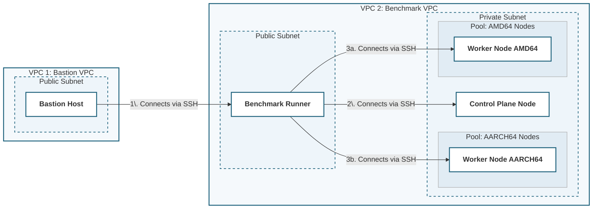

# Overview

This document contains the requirements document for the KASBench Benchmark Runner.  It is one of several software components comprising the suite of software used to run the KASBench benchmark, as shown in the diagram below.  The Benchmark Runner is invoked by the Benchmark Controller running on the Bastion Host.  The Benchmark Controller manages the overall execution of a benchmark run, which consists of multiple trials.  For each trial, it uses OpenTofu to create an AWS VPC that includes all the AWS resources required to run the benchmark.  It then installs and launches the KASBench Benchmark Runner on the Benchmark Host.  The Benchmark Runner is responsible for the following:

- Launching Kubernetes on the Control Plane and Worker nodes using `kubeadm`
- Launching the five KASBench Load Generator instances using the `docker run` command
- Starting the five KASBench Load Generators via the Load Generator API.
- Periodically monitoring the Load Generators during the benchmark run to ensure they are in a running state until the end
- Collecting logs and SQLite databases from the Load Generators at the conclusion of the test and saving them to S3
- Scraping metrics from Prometheus, loading into Pandas DataFrames, saving in Parquet format, and persisting to S3
- Responding to health check API calls from the KASBench Controller




# General Notes

- The KASBench Runner will be a Python FastAPI application using `uv` as its package manager.
- The KASBench Runner will run on the Benchmark Runner Node (see Mermaid diagram above).
- The KASBench Runner will run in a Docker container on the Benchmark Runner node.  It will be on the `kasbench` network (specifically, it will be launched with the `--network kasbench` flag).
- The GitHub repo for the KASBench Runner is https://github.com/kasbench/kasbench-runner.
- The KASBench Load Generator is documented in its [README.md](README_kasbench_load_generator.md) file (See README_kasbench_load_generator in the same directory as this file).
- The five Load Generator roles are back-office, portfolio-manager, trader, investor, and it-operations.
- The Load Generators are on Docker Hub at `kasbench/kasbench-load-generator`.  The current version is 0.0.5.   
- Initially, set the internal variable `benchmark_status` to `not_initialized`
- The AMIs that are used to build the Benchmark Runner, Control Plane, and Worker nodes have kubernetes and its dependencies pre-installed.  The Benchmark Runner also has Docker pre-installed.
- Use structured logging following appropriate conventions.

# API

## POST /initialize

### Definition

- The KASBench Runner will expose an API, which will normally be called by the KASBench Controller.  
- The POST /initialize endpoint is used to configure a benchmark run.  When invoked, the Benchmark Runner will 
	- Configure Kubernetes on the control plane and worker nodes
	- Launch the KASBench Load Generators and verify their health
- The POST /initialize command will accept a request object with the following fields:

| Field Name            | Type     | Default                                 | Required | Python Name             | Description                                                                                                                                                 |
| --------------------- | -------- | --------------------------------------- | -------- | ----------------------- | ----------------------------------------------------------------------------------------------------------------------------------------------------------- |
| runIdentifier         | string   | "run001"                                | No       | run_identifier          | Identifier for the benchmark run.  Used on reports and other outputs.                                                                                       |
| trialIdentifier       | string   | "trial001"                              | No       | trial_identifier        | Identifier for this trial.  Used on reports and outputs.  If the trialIdentifier is not unique for the run, it may lead to confusion and corrupted results. |
| autoscaler            | string   |                                         | Yes      | autoscaler              | An identifier for the autoscaler under test (e.g., HPA, VPA, KEDA)                                                                                          |
| controlPlaneNode      | string   |                                         | Yes      | control_plane_node      | The control plane node's private DNS name or IP address                                                                                                     |
| amdWorkerNodes        | [string] |                                         | Yes      | amd_worker_nodes        | Array of node private DNS names or IP addresses for the amd64 nodes                                                                                         |
| armWorkerNodes        | [string] |                                         | Yes      | arm_worker_nodes        | Array of node private DNS names or IP address for the aarch64 nodes                                                                                         |
| s3Bucket              | string   |                                         | Yes      | s3_bucket               | Name of an S3 bucket in the Benchmark Runner's region                                                                                                       |
| clusterCidrRange      | string   | 10.244.0.0/16                           | No       | cluster_cidr_range      | The CIDR range of the Kubernetes cluster                                                                                                                    |
| kubernetesVersion     | string   | 1.36.1                                  | No       | kubernetes_version      | The Kubernetes version of the cluster (must correspond to the version of Kubernetes in the AMI, which is currently 1.36.1)                                  |
| loadGeneratorImage    | string   | kasbench/kasbench-load-generator:latest | No       | load_generator_image    | DockerHub image name of the load generator to be used in the benchmark run                                                                                  |
| runDurationMinutes    | integer  | 5                                       | No       | run_duration_minutes    | Length of the benchmark run.  Normally, 360 minutes to simulate a 1440-minute (24-hour) run.                                                                |
| globecoUrl            | string   |                                         | Yes      | globeco_url             | Base URL to invoke the GlobeCo Portfolio Management Portal                                                                                                  |
| globecoPort           | integer  | 8080                                    | No       | globeco_port            | Port corresponding to globeco_url.                                                                                                                          |
| skipKubernetesInstall | boolean  | false                                   | No       | skip_kubernetes_install | If true, skip installing Kubernetes.  Used for debugging only                                                                                               |
| skipManifestInstall   | boolean  | false                                   | No       | skip_manifest_install   | If true, skip applying Kubernetes manifests.  Used for debugging only.                                                                                      |
| forceManifestInstall  | boolean  | false                                   | No       | force_manifest_install  | If true, applying manifests will not stop on errors                                                                                                         |
Save this request object so that the settings are available to subsequent API calls.
### Error Handling

Return standard HTTP status codes with clear and unambiguous descriptions.  Security is not a concern.  It is important for the response text to provide sufficient information to understand and resolve the problem.

### Processing Flow

__NOTE:__ If any step in the processing flow fails, abort processing with an appropriate HTTP status code and detailed and specific error message.  The error message should prioritize providing information to assist in debugging and resolution.  It should not obfuscate details for security or any other purpose.

- To avoid duplicate trial Identifiers, the program will immediately perform a conditional write of an empty file called run_identifier/trial_identifier/reserved in the designated s3 bucket (using the `IfNoneMatch="*"` argument in Boto3's `s3.put_object` method).  If the put_object call results in a ClientError exception with a "PreconditionFailed" error code, then the run should immediately abort with an appropriate error code and message.  

#### Kubernetes Install

__IMPORTANT:__ if `skip_kubernetes_install == True`, skip this section.  Proceed to [[#Manifest Install]]

**Note**: The bash scripts and Python code below are offered as examples.  They do not have to be followed literally if better methods are available.

- SSH to the control plane node and execute the following command (substituting request object field kubernetes_version as `--kubernetes-version` and request object field cluster_cidr_range as `--pod-network-cidr`). 
 
```bash
# Note: the CIDR range will be passed from the Benchmark Controller.  If multiple Benchmark Runners are executed simultaneously, they cannot overlap in CIDR range.
sudo kubeadm init \
        --kubernetes-version v1.36.1 \
        --pod-network-cidr 10.244.0.0/16 \
        --cri-socket unix:///run/containerd/containerd.sock
        
mkdir -p $HOME/.kube
sudo cp /etc/kubernetes/admin.conf $HOME/.kube/config
sudo chown $(id -u):$(id -g) $HOME/.kube/config
```

- Run the following command locally (on the Benchmark Runner node):
 
```bash
mkdir -p $HOME/.kube
scp -A ubuntu@<CONTROL_PLANE_HOST_NAME>:/etc/kubernetes/admin.conf $HOME/.kube/config
sudo chown $(id -u):$(id -g) $HOME/.kube/config
```


- SSH to the control plane node and execute the following command:  
 
```bash
chmod + x /home/ubuntu/flannel-install.sh
./home/ubuntu/flannel-install.sh
```

- SSH to the control plane node and execute the following command, saving the result as the cluster joining token (`cluster_token`):
 
```bash
sudo kubeadm token create --print-join-command
```

- SSH to all the nodes identified in both amd_worker_nodes and arm_worker_nodes and execute the following command, substituting `cluster_token` for  `<token`>:
 
```bash
sudo kubeadm join <control-plane-ip>:6443 \
        --token <token> \
        --discovery-token-ca-cert-hash sha256:<hash> \
        --cri-socket unix:///run/containerd/containerd.sock
```

- Verify that all nodes are in a ready state using the `kr8s` library.  Iterate for up to 5 minutes, waiting for all nodes to join the cluster and enter a ready state.  The number of nodes should equal  `1 + len(amd_worker_nodes) + len(arm_worker_nodes)`.  Report progress in the log as you iterate.  If any node appears to be in a state from which recovery is impossible, stop iterating immediately and report the error.   The 5-minute limit for iterating should be configurable.

- Confirm that all nodes are available

- Create the `globeco` namespace if it does not already exist

```bash
kubectl create namespace globeco
```

- Create the `monitoring` namespace for Prometheus

```bash
kubectl create namespace monitoring
```

- Create the `elasticsearch` namespace

```bash
kubectl create namespace elasticsearch
```

- Create the `Jaeger` namespace

```bash
kubectl create namespace observability
```

- Install the EBS CSI driver

```bash
helm repo add aws-ebs-csi-driver https://kubernetes-sigs.github.io/aws-ebs-csi-driver
helm repo update

helm upgrade --install aws-ebs-csi-driver \
  aws-ebs-csi-driver/aws-ebs-csi-driver \
  --namespace kube-system
```

- Create the `ebs-gp3` storage class, if it does not already exist:

```yaml
apiVersion: storage.k8s.io/v1
kind: StorageClass
metadata:
  name: ebs-gp3
provisioner: ebs.csi.aws.com
parameters:
  type: gp3
  encrypted: "true"
volumeBindingMode: WaitForFirstConsumer
allowVolumeExpansion: true
reclaimPolicy: Retain
```

Once this step has run to completion, set internal variable `kubernetes_installed` to True
#### Manifest Install  

__IMPORTANT__ - If `skip_manifest_install == True`, skip this section.  Go to [[#Deploy Load Generators]]

- Iterate through each GitHub repository in the following list.  For each repository, perform the following steps:
	- Read a file  `{Owner}/{Repo}/{Tag}/k8s_aws/k8s.lst` from GitHub (see example below), substituting Owner, Repo, and Tag from the list below.
	- Iterate through the lines of the k8s.lst file, performing the following operations for each line:
		- If the line is blank, ignore it and proceed to the next line
		- If the line begins with a hash ("#"), ignore it and proceed to the next line.  It is a comment.
		- If the line begins with a greater-than sign (">"), treat it as a literal command.  Execute the command that follows the greater-than sign.  Capture the output and include it in the log.
		- If the line begins with a plus sign ("+") followed by an integer, parse the integer and sleep for that number of seconds.  If the value after the plus sign does not parse into an integer, log a warning and sleep 30 seconds
		- Otherwise, treat the line as a manifest file name.  If the file name does not end in ".yaml", append ".yaml" to the name and issue a warning.  Apply the filename as shown in the following example, where {manifest-filename} is the name of the manifest file with a .yaml extension:
			```bash
			kubectl apply -f https://raw.githubusercontent.com/{owner}/{repo}/{tag}/k8s_aws/{manifest-filename}
			```
		- If any of the preceding operations fail, terminate with an appropriate status code and message.  However, if `force_manifest_install` is True, log the error but continue processing.  Do not abort.  This will be used when debugging new manifests.  It will not be used when conducting a benchmark.


| Service                     | Owner    | Repo                                 | GitHub URL                                                       | Tag    |
| --------------------------- | -------- | ------------------------------------ | ---------------------------------------------------------------- | ------ |
| Kafka                       | kasbench | globeco-kafka                        | https://github.com/kasbench/globeco-kafka                        | v1.1.1 |
| Confirmation                | kasbench | globeco-confirmation-service         | https://github.com/kasbench/globeco-confirmation-service         | v1.1.1 |
| Execution                   | kasbench | globeco-execution-service            | https://github.com/kasbench/globeco-execution-service            | v1.1.1 |
| Fix Engine                  | kasbench | globeco-fix-engine                   | https://github.com/kasbench/globeco-fix-engine                   | v1.1.1 |
| Order Generation            | kasbench | globeco-order-generation-service     | https://github.com/kasbench/globeco-order-generation-service     | v1.1.1 |
| Order                       | kasbench | globeco-order-service                | https://github.com/kasbench/globeco-order-service                | v1.1.1 |
| Portfolio Accounting        | kasbench | globeco-portfolio-accounting-service | https://github.com/kasbench/globeco-portfolio-accounting-service | v1.1.1 |
| Portfolio Management Portal | kasbench | globeco-portfolio-management-portal  | https://github.com/kasbench/globeco-portfolio-management-portal  | v1.1.1 |
| Portfolio                   | kasbench | globeco-portfolio-service            | https://github.com/kasbench/globeco-portfolio-service            | v1.1.1 |
| Pricing                     | kasbench | globeco-pricing-service              | https://github.com/kasbench/globeco-pricing-service              | v1.1.1 |
| Security                    | kasbench | globeco-security-service             | https://github.com/kasbench/globeco-security-service             | v1.1.1 |
| Trade                       | kasbench | globeco-trade-service                | https://github.com/kasbench/globeco-trade-service                | v1.1.1 |
| Observability tools$^*$     | kasbench | globeco-observability                | https://github.com/kasbench/globeco-observability                | v1.1.1 |
$^*$ Includes Prometheus, Jaeger, OpenTelemetry Collector, Elasticsearch, and Metrics Server. 

Sample code:

```python
import requests

# Define the repository parameters
owner = "kasbench"
repo = "globeco-portfolio-service"
tag = "v1.1.0"
file_path = "k8s_aws/k8s.lst"

# Construct the raw GitHub URL
url = f"https://raw.githubusercontent.com/{owner}/{repo}/{tag}/{file_path}"

# Fetch the content
response = requests.get(url)

if response.status_code == 200:
    file_content = response.text
    print("File fetched successfully!\n")
    print(file_content)
else:
    print(f"Failed to fetch file. Status code: {response.status_code}")
    print("Check if the tag, path, or repository privacy settings are correct.")
```

Once this step has run to completion, set internal variable `globeco_installed` to True

#### Deploy Load Generators

The load generators will be run in Docker on the Benchmark Runner node.  Docker is pre-installed in the AMI used to build the node. 

- Assume that the following command has already been run:
```bash
docker network create kasbench
```
	
- Validate and throw a fatal error if the kasbench network has not previously been created.

- Run RabbitMQ in Docker using the following command (make the docker image name configurable):
```bash
docker run -d --network kasbench --name rabbitmq -p 5672:5672 -p 15672:15672 rabbitmq:4-management
```


- The load generator image on Docker Hub is passed in the request object as `load_generator_image`.
- Run five instances of the load generator for each of the roles, substituting {Port Number} and {Role} from each of the rows in the table below.  Substitute {load_generator_image} with the corresponding value from the request object.  If a Docker instance is already running by that name and on that port, issue a warning but do not fail.

```bash
docker run -d --network kasbench -p 8080:{Port Number} -e RABBITMQ_HOST=rabbitmq --name {Role} {load_generator_image}
```

| Role              | Port Number |
| ----------------- | ----------- |
| back-office       | 8081        |
| portfolio-manager | 8082        |
| trader            | 8083        |
| investor          | 8084        |
| it-operations     | 8085        |

- If any `docker run` command returns an error, exit with an appropriate HTTP status and detailed error message.
- Verify that each service is running, by making the following call for each row in the table above:

```bash
curl http://{Role}:8080/health
```
- This command should work, since the KASBench Runner is running in Docker on the `kasbench` network.
- The command is successful if it returns a 200 status code and "Status" is "not-started" and "Health" is "healthy," as in the following response object:
```json
{"Status":"not-started","Role":"","Health":"healthy","SuccessCount":0,"FailureCount":0,"InternalErrorCount":0,"LastFiveErrorMessages":[],"CurrentTimeStamp":"2026-06-10T12:16:09.399Z","StartTime":null,"EndTime":null}
```
- Repeat the health check up to three times with 5 seconds between iteration to get a successful response.  If any service is not successfully running within three attempts, abort with an appropriate status code and a descriptive error message.

Once this step has run to completion, set internal variable `load_generators_installed` to True

Once `kubernetes_installed`, `globeco_installed`, and `load_generators_installed` are all True, set `initialization_complete` to True and set `benchmark_status` to `not-started`.
## POST /start

The start command initializes a benchmark run and then completes.  The benchmark will continuing running for its full duration or until it is aborted or encounters a fatal error.  Only one benchmark can be running at a time.  If a benchmark has started but has not completed, an appropriate HTTP status code and appropriate error message must be returned.

This API takes an empty request object `{}`.

Internal variable `initialization_complete` must be True.  If False, return an appropriate HTTP status code and detailed message.

Record internal variable `benchmark_start_time` as the current timestamp.

POST /start to each of the load generators in the following table using the command:

```bash
curl -H 'Content-Type: application/json' \
  -d '{"Role": "{Role}","BenchmarkLengthMinutes": {run_duration_minuts},"BaseLoadIntensity": {Base Load Intensity},"SpawnRate": {Spawn Rate},"BaseDelayPercentage": {Base Delay Percentage},"KasbenchUrl": "{globeco_url}:{globeco_port}"}'  \
  http://{Role}:8080/start
```

Where {Role}, {Base Load Intensity}, {Base Delay Percentage}, and {Spawn Rate} come from the table below.  Variables {run_duration_minutes}, {globeco_url}, and {globeco_port} are from the request object of the POST /init API.  

| Role              | Base Load Intensity | Base Delay Percentage | Spawn Rate |
| ----------------- | ------------------- | --------------------- | ---------- |
| back-office       | 100                 | 100                   | 10         |
| portfolio-manager | 100                 | 100                   | 10         |
| trader            | 100                 | 100                   | 10         |
| investor          | 10                  | 100                   | 10         |
| it-operations     | 100                 | 100                   | 1          |
__NOTE:__ Ideally, all five roles would be started simultaneously.  Start the five roles as close to simultaneous as possible.

Verify that each service is running, by making the following call for each row in the table above:

```bash
curl http://{Role}:8080/health
```
- This command should work, since the KASBench Runner is running in Docker on the `kasbench` network.
- The command is successful if it returns a 200 status code and "Status" is "running" and "Health" is "healthy," as in the following response object:
```json
{"Status":"running","Role":"back-office","Health":"healthy","SuccessCount":0,"FailureCount":0,"InternalErrorCount":0,"LastFiveErrorMessages":[],"CurrentTimeStamp":"2026-06-10T12:17:07.652Z","StartTime":"2026-06-10T12:17:02.897Z","EndTime":null}
```
- Repeat the health check up to three times with 5 seconds between iteration to get a successful response.  If any service is not successfully running within three attempts, abort with an appropriate status code and a descriptive error message.

Set the internal variable `benchmark_status` to "running".


## GET /status

__IMPORTANT__: Update load generator /health to get start time and end time.

### Pre-processing

- If `benchmark_status` is "not-initialized", pre-processing is complete.  We can't run the following steps until initialization is complete.  Skip to [Processing](###Processing) and return a response object with only status: "not initialized" valued.
- Iterate through the roles (back-office, portfolio-manager, trader, investor, it-operations), calling GET /health on each (see POST /start for details on how to call the GET /health API for each role).  Retrieve and save the status, startTime, and endTime of each role.  
- If all roles show status success, set the internal variable endTime to the latest endTime across roles, and set the internal variable `load_generation_complete` to True.  Set the internal variable `benchmark_status` to "success".
- If any role shows a "failed" status, set the internal variable endTime to the earliest endTime among the failed load generators. Set the internal variable `load_generation_failure` to True.  Set the internal variable `benchmark_status` to "failed".


### Processing

If no errors are encountered in pre-processing, return status code 200 with the following response object.  Otherwise, return an appropriate status code and detailed error message.

```json
{
	status: "not-initialized", "not-started", "running", "successful", "failed", or "aborted"
	"startTime": Timestamp or null,
	"endTime": Timestamp or null,
	"loadGenerators": [{"role": "back-office", "portfolio-manager", "trader", "investor", or "it-operations",
			"startTime": timestamp,
			"endTime": timestamp,
			"status": string,
	}, ...]
	
}
```

Mapping


| Field                    | Mapping                                                 |
| ------------------------ | ------------------------------------------------------- |
| status                   | Internal variable `benchmark_status`                    |
| startTime                | Internal variable `start_time` or null/empty if not set |
| endTime                  | Internal variable `end_time` or null/empty if not set   |
| loadGenerators.startTime | The start time as reported by the role                  |
| loadGenerators.endTime   | The end time as reported by the role                    |
| loadGenerators.status    | The status as reported by the role                      |


## GET /output/{role}

This API forwards the request to the GET /download-output API of the appropriate container for the requested {role} and re-renders the output from that call. The following is an example of calling the GET /download-output API.  The `--output` argument is not mandatory.  Use whatever approach is best for re-rendering the output. 

```bash
curl http://{role}:8080/download-output --output {role}.log
```

For reference, the following code is from the KASBench Load Generator.  It is the code that handles the /download-output API and streams the response:

```python
@app.get("/download-output", responses={409: {"model": ErrorResponse}, 404: {"model": ErrorResponse}})
async def download_output() -> StreamingResponse:
    """Stream the subprocess output file.

    Returns 409 if subprocess is still running.
    Returns 404 if no subprocess has been started.
    Returns 200 with text/plain content (even if empty).
    """
    if subprocess_manager.is_running:
        raise HTTPException(status_code=409, detail="Subprocess is still active")

    if subprocess_manager._status == StatusEnum.NOT_STARTED:
        raise HTTPException(status_code=404, detail="No output available")

    return StreamingResponse(
        _file_iterator(config.OUTPUT_PATH),
        media_type="text/plain",
    )
```

## Get /db/{role}

This API forwards the request to the GET /download-db API of the appropriate container for the requested {role} and re-renders the output from that call. The following is an example of calling the GET /download-db API.  The `--output` argument is not mandatory.  Use whatever approach is best for re-rendering the output. 

```bash
curl http://{role}:8080/download-db --output {role}.db
```

For reference, the following code is from the KASBench Load Generator.  It is the code that handles the /download-db API and streams the response:

```python
@app.get("/download-db", responses={409: {"model": ErrorResponse}, 404: {"model": ErrorResponse}})
async def download_db() -> StreamingResponse:
    """Stream the SQLite database file.

    Returns 409 if subprocess is still running.
    Returns 404 if the database file does not exist.
    """
    if subprocess_manager.is_running:
        raise HTTPException(status_code=409, detail="Subprocess is still active")

    if not os.path.exists(config.DB_PATH):
        raise HTTPException(status_code=404, detail="Database file not available")

    return StreamingResponse(
        _file_iterator(config.DB_PATH),
        media_type="application/x-sqlite3",
    )
```

## POST /abort

**To be added later**

## GET /metrics

**To be added later**

